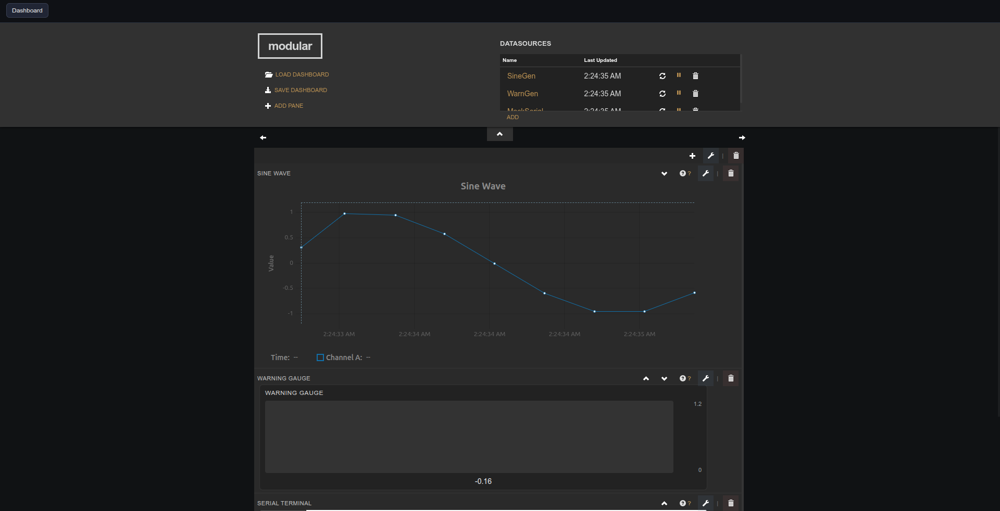
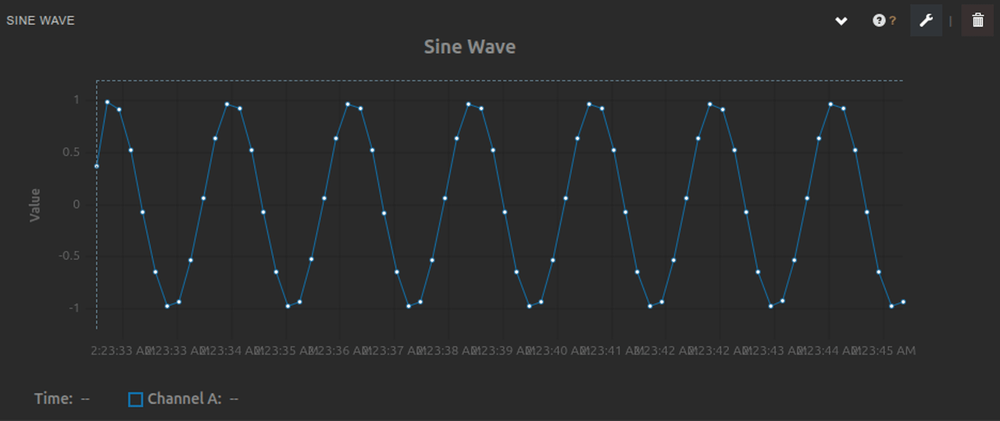
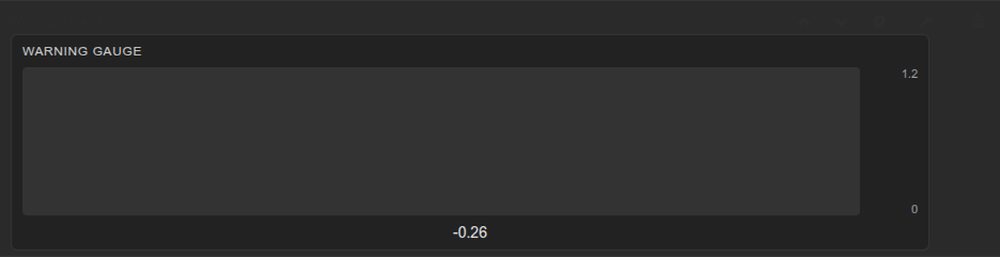
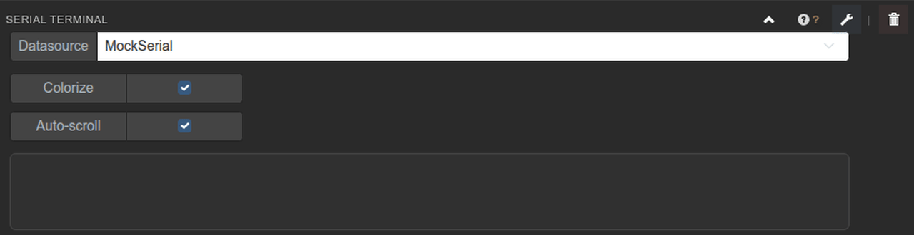
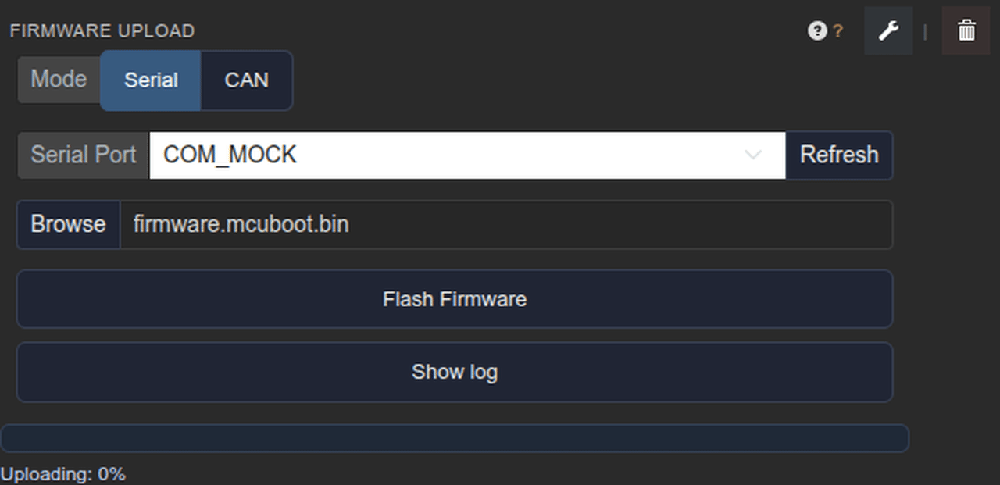
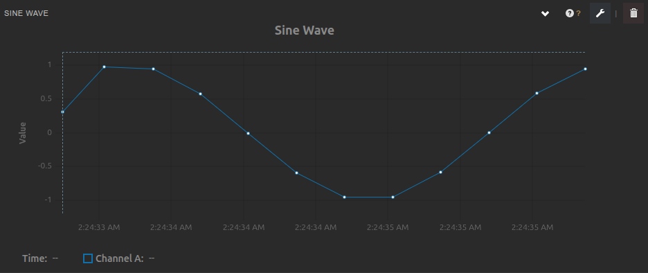
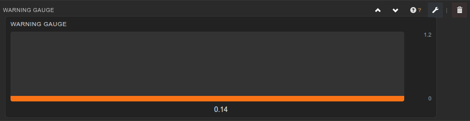
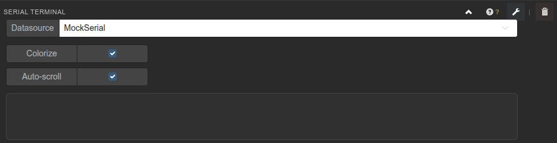

# Modular

<!-- README refresh: community-focused overview + feature expansion -->
Modular is a desktop app for real-time instrumentation, dashboards, and firmware workflows.
It is built on Electron + Freeboard with custom widgets for serial, plotting, and device control.

Modular is built for fast feedback loops: connect hardware, stream data, visualize behavior, and iterate
without leaving the dashboard.

## Hero



## Why Modular

- **Own your data**: local-first dashboards, no cloud dependency.
- **Real-time insight**: live plots, gauges, and terminals for fast iteration.
- **Hands-on tooling**: flash firmware, record CSVs, and build repeatable test setups.
- **Community-ready**: widget docs and examples ship with the app.

## Highlights

- **Serial datasources**: parse numeric streams with custom separators and end-of-line rules.
- **Plotting**: uPlot-based charts with UI + channel manager helpers.
- **Recording**: CSV capture with timestamps and ordering options.
- **Flashing**: mcumgr integration for supported boards.
- **ThingSet over CAN**: local tooling to scan and query nodes.

## What you can build

- **Bring-up dashboards**: live plots + gauges + terminal logs in one view.
- **Test benches**: repeatable runs with CSV recording, tagged outputs, and saved dashboards.
- **Operator panels**: device selectors, setpoints, and status toggles in a clear layout.
- **Lab notebooks**: ship examples and docs with the app so experiments are reproducible.

## Feature overview

- **Composable widgets**: mix plots, gauges, terminals, and control panels in a single dashboard.
- **Helper widgets**: auto-spawn UI controllers and channel managers for faster setup.
- **Dashboard portability**: save and load dashboards as JSON and share with teammates.
- **Local-first workflow**: no account needed, no cloud required, no telemetry by default.
- **Documentation inside the app**: per-widget help tabs and examples ship with the binaries.

## Dashboard preview

<!-- README media: generated from dev/tools/capture_readme_screenshots.js + screencasts. -->


### Plot


### Gauge


### Terminal


### Firmware upload


## Static screenshots





## Quick start

1. Install [Node.js](https://nodejs.org/) 20 or later.
2. Install dependencies:
   ```bash
   npm install
   ```
   On Windows, `socketcan` is optional and will be skipped. This is expected.
3. Launch in development:
   ```bash
   npm start
   ```
   The dashboard loads from `app/dashboard`.
4. Build distributables:
   ```bash
   npm run dist
   ```
   Packages are placed in `dist/`.

## Screens, widgets, and docs

- Widget docs and examples live under `app/docs/` and `app/dashboard/docs/`.
- Example dashboards for development live under `dev/test_dashboards/`.

## Typical workflows

1. **Connect** a serial datasource (mock or real hardware).
2. **Inspect** with a terminal and a quick plot or gauge.
3. **Control** using setpoints or actions in dedicated widgets.
4. **Record** a CSV for analysis and share the dashboard JSON with your team.

## ThingSet over CAN

JavaScript implementation lives in `app/js/`:

- `app/js/ts_can_utils.js` – CAN ID builder and ISO-TP response reassembly.
- `app/js/thingset_bin.js` – ISO-TP TX/RX and ThingSet client (`ThingSetCAN`).
- `app/js/scan.js` – scans the bus, writes `thingset/nodes.json`.
- `app/js/query_nodes.js` – explores a node tree, writes `thingset/node_<addr>_tree.json`.
- `app/js/can_adapter.js` – CAN bus wrapper (SocketCAN on Linux, `ffi-napi` vendor driver on Windows).

Dependencies:

- `socketcan` (Linux) and `cbor` (in `package.json`)
- Windows optional: `ffi-napi` + `ref-napi` with vendor DLL

Commands:

- Scan the bus: `npm run scan:can`
- Build node trees: `npm run ts:query`
- Basic client test: `npm run ts:test`

### Linux SocketCAN setup (GUI auth)

- Script: `app/scripts/setup_can_linux.sh` configures `can0` at 500000 bps.
- IPC: `ipcRenderer.invoke('can-setup-linux')` uses `pkexec` for GUI auth.
- Linux-only; ensure a PolicyKit agent is running.

## Windows build notes

- CAN via SocketCAN is Linux-only.
- Windows CAN requires a vendor driver and `ffi-napi` binding (see `app/js/can_adapter.js`).
- If native modules need to build, install MSVC Build Tools and Python.

## Repository layout

- `app/main.js` – Electron main process for serial and IPC.
- `app/flasher.js` – mcumgr firmware flashing helper.
- `app/dashboard/` – bundled Freeboard + custom plugins.
- `dev/test_dashboards/` – dev/test dashboards.

## License

MIT License. See `app/dashboard/LICENSE` for Freeboard components bundled with the app.
