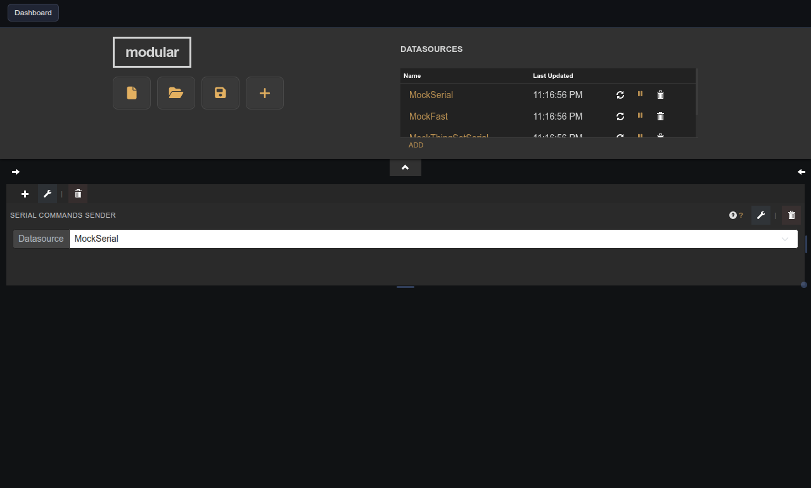
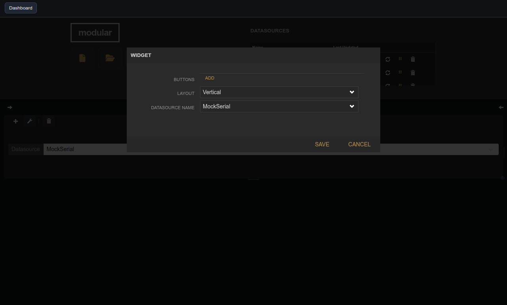

# Push Buttons

| Widget View | Edit Widget Window View |
|---|---|
|  |  |

Configurable buttons that send predefined text commands over a serial datasource.

## Parameters

| Parameter  | Type   | Default  | Description                                        |
|------------|--------|----------|----------------------------------------------------|
| Buttons    | array  | —        | List of label/command pairs to create buttons for. |
| Layout     | option | vertical | Arrange buttons vertically or horizontally.        |
| Datasource | option | —        | Serial datasource that receives the commands.      |
