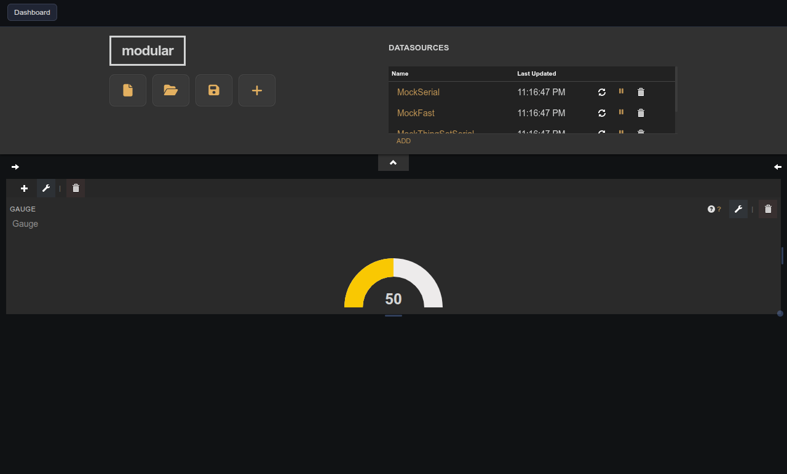

# Gauge

Legacy JustGage dial gauge kept for backwards compatibility with older dashboards.

## Parameters

| Parameter | Type       | Default | Description                                  |
|-----------|------------|---------|----------------------------------------------|
| Title     | text       | —       | Label shown in the pane header.              |
| Value     | calculated | —       | Calculated expression rendered by the gauge. |
| Units     | text       | —       | Short unit label shown inside the dial.      |
| Minimum   | number     | 0       | Lower bound of the dial range.               |
| Maximum   | number     | 100     | Upper bound of the dial range.               |

## Notes

Compatibility-only widget — hidden from the add-widget picker but remains loadable for existing dashboards. For new dashboards use the gauge family instead: Vertical Gauge, Horizontal Gauge, Radial Arc Gauge, Radial Needle Gauge, or Donut Gauge.
