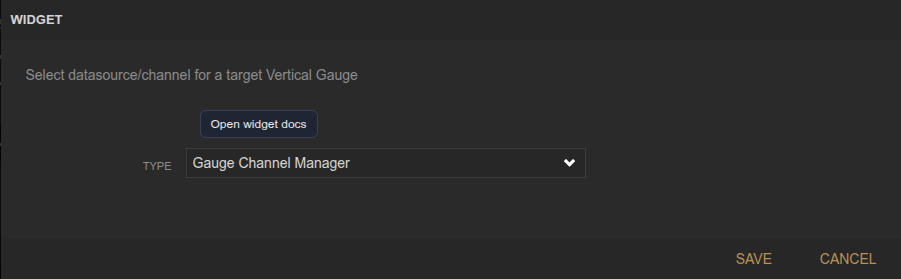
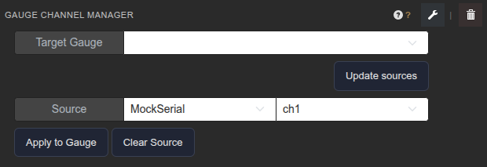

<!-- Widget documentation (auto-generated from widget definitions). -->
# Gauge Channel Manager

## What it does
Select datasource/channel for a target Vertical Gauge widget.

## Status
- Compatibility-only: this widget remains loadable for older dashboards.
- Preferred replacement: configure `vertical_gauge` directly from its integrated editor instead of using a separate manager.

## Creation (settings)

- No settings: All configuration happens in the panel UI.

## Usage (in dashboard)

- Target Gauge: Select the vertical gauge to bind.
- Update sources: Refresh the datasource/device/variable list.
- Source: Select datasource, device, and variable.
- Apply to Gauge: Write the selected source into the gauge settings.
- Clear Source: Remove the gauge source binding.
