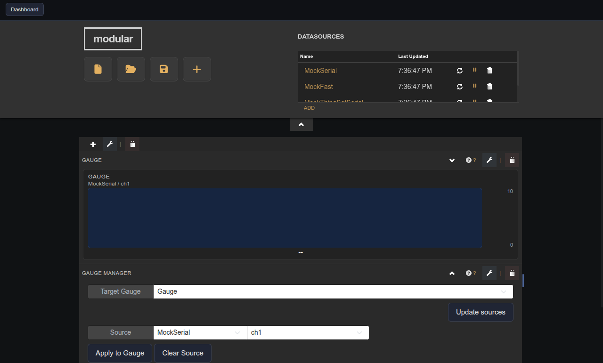

# Gauge Channel Manager

Companion panel that binds a datasource variable to a target Vertical Gauge widget.

## Notes

This widget has no creation-time settings. It is a compatibility helper — prefer the Vertical Gauge integrated editor (pencil icon) for new dashboards.

In the panel UI, select the target gauge, refresh the source list, pick datasource/device/variable, then click **Apply to Gauge**.
