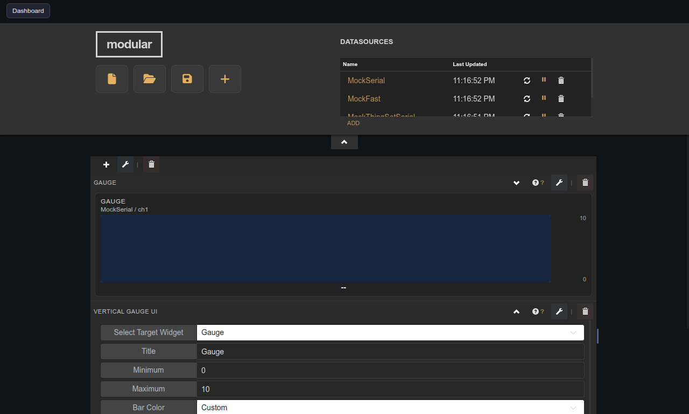

# Vertical Gauge UI

Companion panel that configures title, range, color, and alarm settings on a target Vertical Gauge widget.

## Notes

This widget has no creation-time settings. It is a compatibility helper — prefer the Vertical Gauge integrated editor (pencil icon) for new dashboards.

In the panel UI, select the target gauge, adjust Title, Min/Max, Bar Color, Alarm threshold, and Refresh Rate, then click **Apply Settings**.
