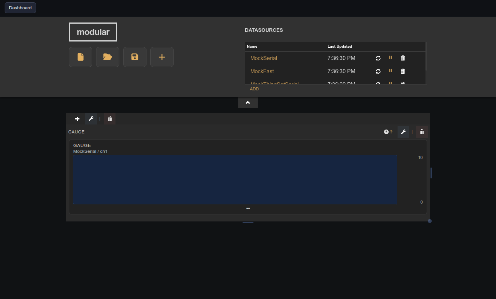

# Vertical Gauge

Single-channel vertical bar gauge with integrated source binding, warning/critical zones, and optional alarm state.

## Parameters

| Parameter    | Type    | Default | Description                                    |
|--------------|---------|---------|------------------------------------------------|
| Title        | text    | —       | Label shown in the pane header.                |
| Min          | number  | 0       | Lower bound of the gauge range.                |
| Max          | number  | 100     | Upper bound of the gauge range.                |
| Units        | text    | —       | Unit label shown alongside the value.          |
| Bar Color    | option  | blue    | Active fill color.                             |
| Refresh Rate | number  | 500     | Update interval in milliseconds.               |
| Alarm        | boolean | false   | Flash red when the critical zone is breached.  |

## Notes

Source binding (datasource, device, variable) and zone thresholds (warning, critical) are configured in the gauge's integrated editor panel — click the pencil icon on the widget.
