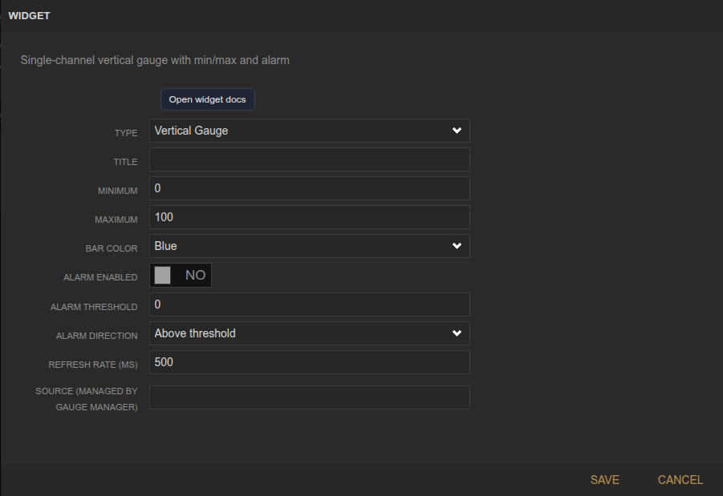
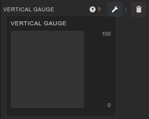

<!-- Widget documentation (auto-generated from widget definitions). -->
# Vertical Gauge

## What it does
Single-channel vertical gauge with min/max bounds and optional alarm state.

## Creation (settings)

- Title: Widget title shown above the gauge.
- Minimum / Maximum: Scale range for the gauge.
- Bar Color: Color theme for the fill bar.
- Alarm Enabled: Enable alarm threshold highlighting.
- Alarm Threshold: Value that triggers the alarm state.
- Alarm Direction: Trip when above or below the threshold.
- Refresh Rate: Polling interval in milliseconds.
- Source (managed by Gauge Manager): Data source binding set by the Gauge Manager.

## Usage (in dashboard)

- Gauge fill: Represents the current value as a percentage of the range.
- Min/Max labels: Show configured bounds.
- Value: Numeric readout of the current value.
- Alarm styling: Red highlight when the threshold is tripped.

