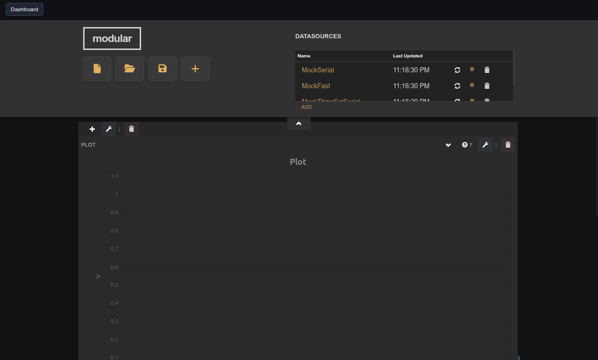

# Plot Channel Manager

Companion panel that adds, removes, and edits the data channels on a target Plot (uPlot) widget.

## Notes

This widget has no creation-time settings. It is a compatibility helper — prefer the integrated Plot editor (pencil icon on the Plot widget) for new dashboards.

In the panel UI, select the target plot, choose datasource/device/variable and an optional math transform (identity, scale, offset, or multiply), then click **Add channel**.
