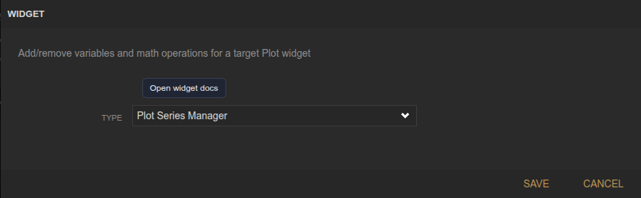
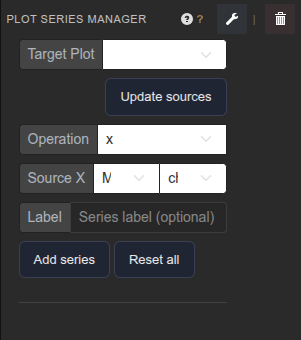

<!-- Widget documentation (auto-generated from widget definitions). -->
# Plot Channel Manager

## What it does
Manage plot channel definitions: datasource, variables, and math operations for a target plot.

## Creation (settings)

- No settings: All configuration happens in the panel UI.

## Usage (in dashboard)

- Target Plot: Select the plot to edit channels for.
- Update sources: Refresh datasources/devices/variables list.
- Operation: Choose identity, scale, offset, or x*y math.
- k / b: Parameter for scale or offset operations.
- Source X / Source Y: Pick datasource/device/variable inputs.
- Label: Optional channel label.
- Add channel: Append a new channel definition.
- Reset channels: Clear all channels from the target plot.
- Channel list: Shows the active channel definitions.
