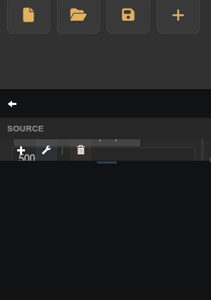

# Plot UI Controller

Companion panel that configures a target Plot (uPlot) widget's display, axes, and channels.

## Notes

This widget has no creation-time settings. It is a compatibility helper — prefer the integrated Plot editor (pencil icon on the Plot widget) for new dashboards.

In the panel UI, select the target plot, then adjust Duration, Refresh Rate, Y axis bounds, Show Legend, and Color Palette, and click **Apply Settings**.
