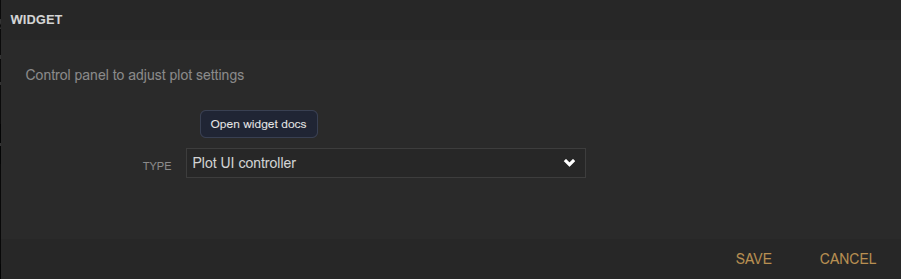
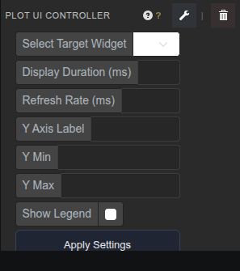

<!-- Widget documentation (auto-generated from widget definitions). -->
# Plot UI Controller

## What it does
Control panel for adjusting settings of a target Plot (uPlot) widget.

## Creation (settings)

- No settings: This widget is configured directly in the panel UI.

## Usage (in dashboard)

- Select Target Widget: Choose the plot widget to control.
- Display Duration: Time window shown on the X axis (ms).
- Refresh Rate: How often the plot refreshes (ms).
- Y Axis Label: Label text shown on the Y axis.
- Y Min / Y Max: Manual Y axis bounds (optional).
- Show Legend: Toggle legend visibility.
- Apply Settings: Push updates to the target plot.

