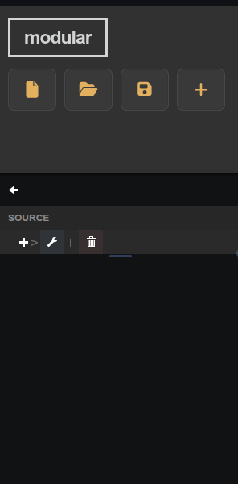

# Plot (uPlot)

Realtime uPlot chart that streams live values or renders a full dataset with per-channel math transforms.

## Parameters

| Parameter    | Type    | Default | Description                                           |
|--------------|---------|---------|-------------------------------------------------------|
| Title        | text    | —       | Label shown in the pane header.                       |
| Y Label      | text    | —       | Label for the Y axis.                                 |
| Duration     | number  | 5000    | Visible time window in milliseconds.                  |
| Refresh Rate | number  | 500     | Plot update interval in milliseconds.                 |
| Min Y        | number  | —       | Minimum Y bound; leave empty for auto.                |
| Max Y        | number  | —       | Maximum Y bound; leave empty for auto.                |
| Show Legend  | boolean | false   | Show channel names in the legend.                     |
| Channels     | list    | —       | Series definitions managed in the Edit Widget dialog. |

## Notes

Duration, Refresh Rate, Y axis settings, and Channels are configured through the **Plot UI Controller** or **Plot Channel Manager** helper widgets. Add them to the same pane to expose the full settings panel.
