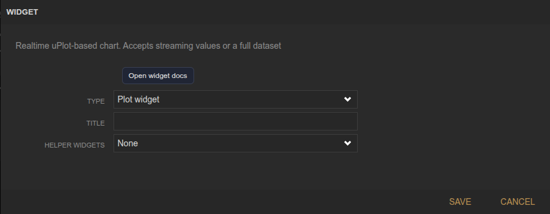
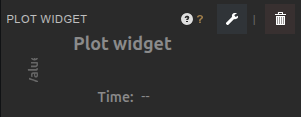

<!-- Widget documentation (auto-generated from widget definitions). -->
# Plot (uPlot)

## What it does
Realtime uPlot chart for streaming values or full datasets. Use helper widgets to manage series and tuning.

## Creation (settings)

- Title: Widget title shown in the header.
- Helper Widgets: Auto-spawn the Plot UI Controller and/or Plot Series Manager when the plot is created.

## Usage (in dashboard)

- Plot area: Shows live series data.
- Legend: Displays series names when enabled from the UI Controller.

