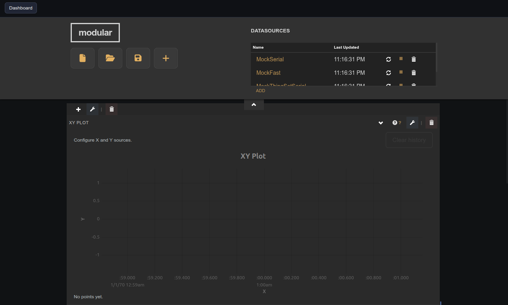

# XY Source Manager

Companion panel that binds the X and Y data sources on a target XY Plot widget.

## Notes

This widget has no creation-time settings. It is a compatibility helper — prefer the integrated XY Plot editor (pencil icon on the XY Plot widget) for new dashboards.

In the panel UI, select the target XY plot, pick the datasource, device, variable, and optional transform for each axis, then click **Apply**.
