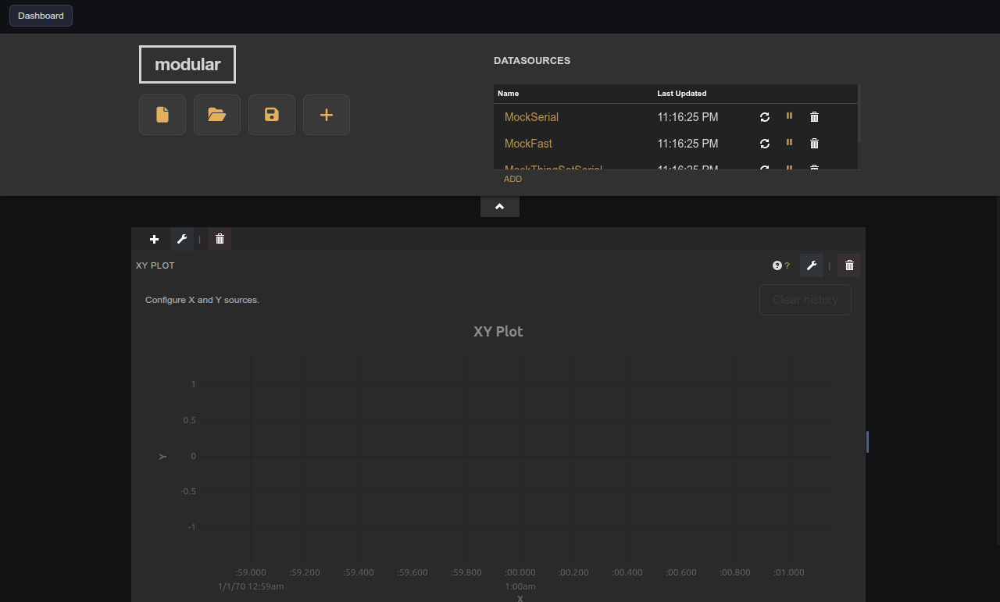
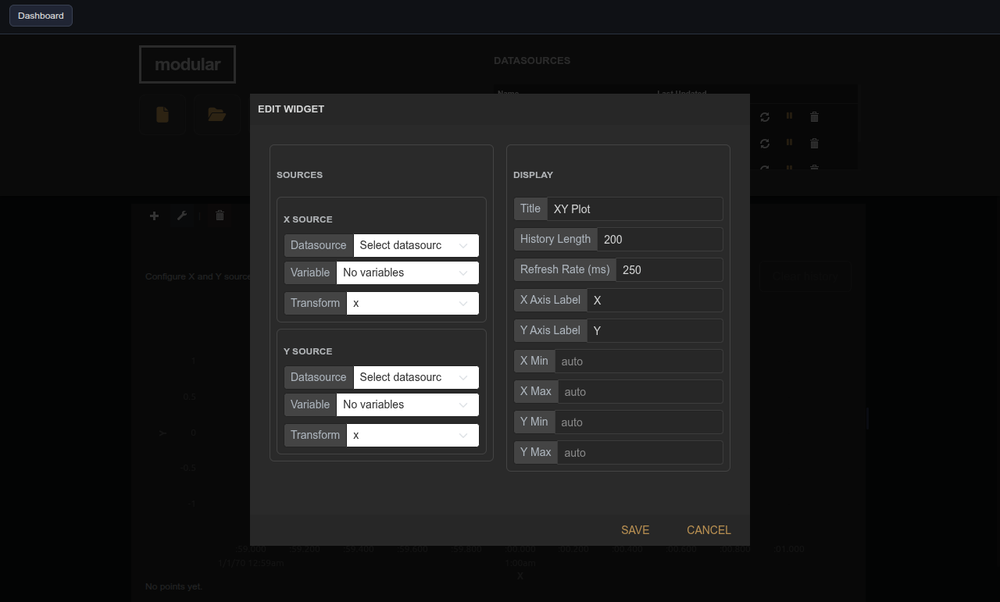

# XY Plot

| Widget View | Edit Widget Window View |
|---|---|
|  |  |

Plots live X versus Y data as a trajectory with trailing history.

## Parameters

| Parameter    | Type   | Default | Description                                       |
|--------------|--------|---------|---------------------------------------------------|
| Title        | text   | XY Plot | Label shown in the pane header.                   |
| History      | number | 200     | Number of recent points retained in the trail.    |
| Refresh Rate | number | 500     | Poll and redraw interval in milliseconds.         |
| X Label      | text   | —       | Label for the X axis.                             |
| Y Label      | text   | —       | Label for the Y axis.                             |
| Min X        | number | —       | Minimum X bound; leave empty for auto.            |
| Max X        | number | —       | Maximum X bound; leave empty for auto.            |
| Min Y        | number | —       | Minimum Y bound; leave empty for auto.            |
| Max Y        | number | —       | Maximum Y bound; leave empty for auto.            |
| Sources      | object | —       | X and Y source definitions managed via the panel. |

## Notes

X and Y source bindings are configured through the **XY Source Manager** helper widget. Add it to the same pane to expose the full source selection panel.
