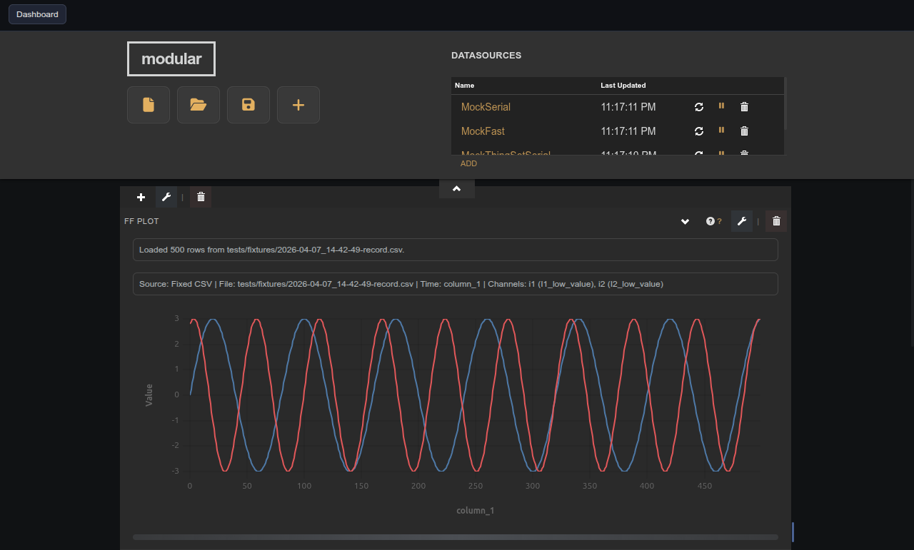

# Fast Frame Channel Manager

Companion panel that selects the CSV source, sets the X column, and adds or removes Y channels on a target Fast Frame Plot widget.

## Notes

This widget has no creation-time settings. It is a compatibility helper — prefer the Fast Frame Plot integrated editor (pencil icon) for new dashboards.

In the panel UI, select the target plot, pick a CSV file, choose the X variable (leave empty for row index), select a Y variable, set label/color/visibility, then click **Add Channel**.
