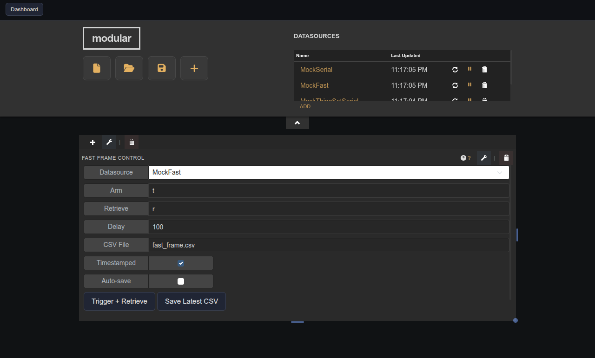

# Fast Frame Control

Triggers fast-frame acquisitions over serial, monitors status, and exports the captured dataset to CSV.

## Parameters

| Parameter           | Type    | Default        | Description                                          |
|---------------------|---------|----------------|------------------------------------------------------|
| Datasource          | option  | —              | Fast Frame datasource to trigger and monitor.        |
| Arm Command         | text    | t              | Command sent to arm the acquisition.                 |
| Retrieve Command    | text    | r              | Command sent to retrieve the stored frame.           |
| Retrieve Delay (ms) | number  | 100            | Delay between arm and retrieve commands.             |
| CSV Base File Path  | text    | fast_frame.csv | Output path for exported CSV files.                  |
| Timestamped Name    | boolean | true           | Prepend a timestamp to the CSV file name.            |
| Auto-save           | boolean | false          | Automatically export CSV when acquisition completes. |
| Status Refresh (ms) | number  | 250            | Poll interval for acquisition status updates.        |
