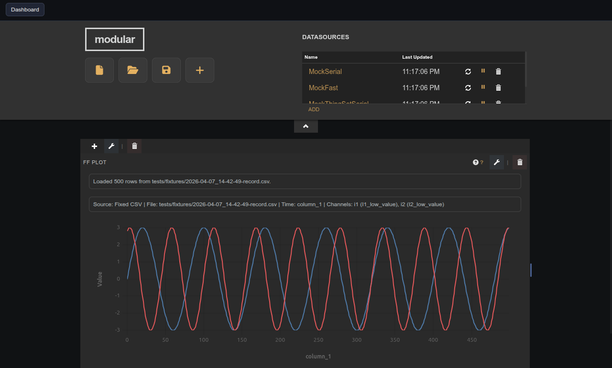
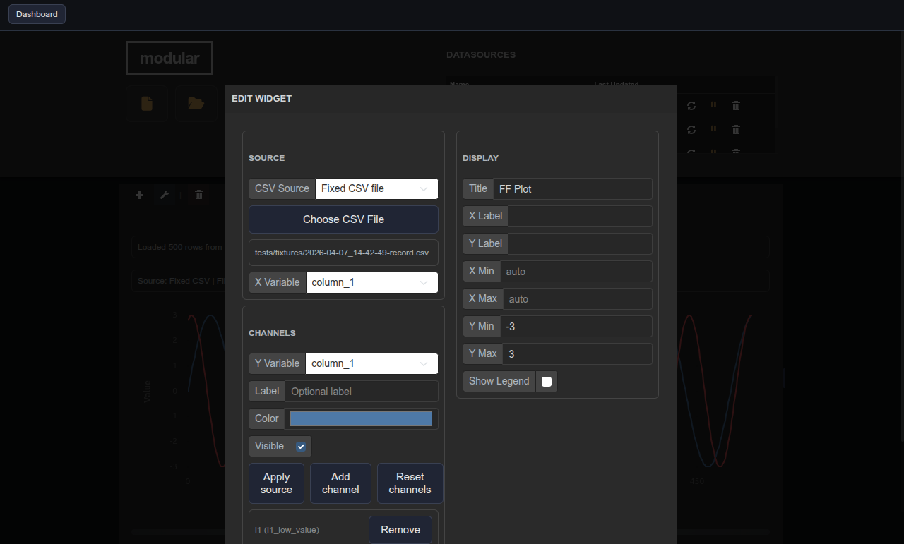

# Fast Frame Plot

| Widget View | Edit Widget Window View |
|---|---|
|  |  |

Plots one or more fast-frame CSV channels against a selected X column or sample index.

## Parameters

| Parameter   | Type    | Default         | Description                                                       |
|-------------|---------|-----------------|-------------------------------------------------------------------|
| Title       | text    | Fast Frame Plot | Label shown in the pane header.                                   |
| CSV Source  | select  | Fixed CSV file  | How the fast-frame data file is provided.                         |
| X Variable  | select  | —               | Column used as the horizontal axis; leave empty for sample index. |
| X Label     | text    | —               | Label for the X axis.                                             |
| Y Label     | text    | —               | Label for the Y axis.                                             |
| X Min       | number  | —               | Minimum X bound; leave empty for auto.                            |
| X Max       | number  | —               | Maximum X bound; leave empty for auto.                            |
| Y Min       | number  | —               | Minimum Y bound; leave empty for auto.                            |
| Y Max       | number  | —               | Maximum Y bound; leave empty for auto.                            |
| Show Legend | boolean | false           | Show channel names in the legend.                                 |
| Channels    | list    | —               | Y source definitions managed via the panel.                       |

## Notes

The full configuration panel — CSV source, X variable, axis labels, bounds, legend, and channel definitions — is accessible by clicking the pencil (edit) icon on the widget. The **Fast Frame UI** and **Fast Frame Channel Manager** are legacy companion panels; prefer the integrated editor for new dashboards.
