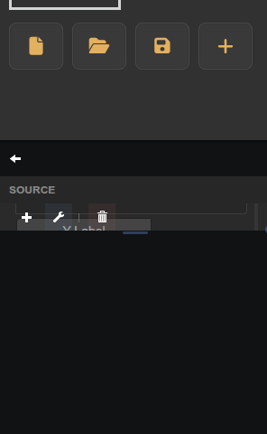

# Fast Frame UI

Companion panel that configures the title and axes on a target Fast Frame Plot widget.

## Notes

This widget has no creation-time settings. It is a compatibility helper — prefer the Fast Frame Plot integrated editor (pencil icon) for new dashboards.

In the panel UI, select the target fast-frame plot, adjust Title, X/Y labels, and axis bounds, then click **Apply Settings**.
