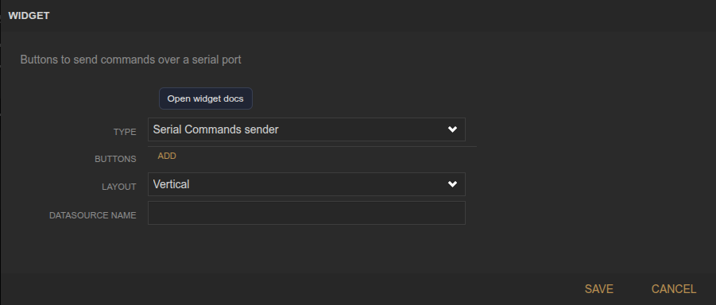
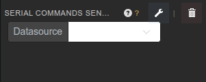

<!-- Widget documentation (auto-generated from widget definitions). -->
# Serial Command Buttons

## What it does
Send predefined commands over a serial datasource using buttons.

## Creation (settings)

- Buttons: List of label/command pairs.
- Layout: Vertical or horizontal button layout.
- Datasource Name: Serial datasource that receives commands.

## Usage (in dashboard)

- Datasource selector: Choose the serial datasource (MockSerial).
- Command buttons: Click to send Start/Stop/Reset commands.

