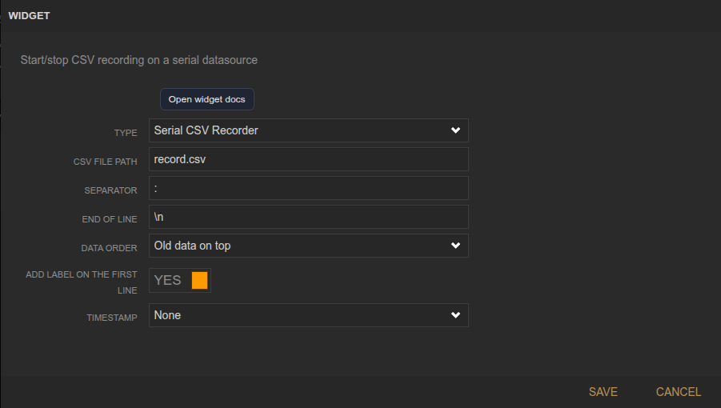
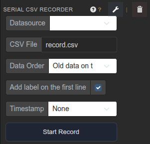

<!-- Widget documentation (auto-generated from widget definitions). -->
# Serial CSV Recorder

## What it does
Record serial stream data to CSV files.

## Creation (settings)

- CSV File Path: Output CSV path.
- Separator: Field separator used in the incoming stream.
- End Of Line: Line ending used in the stream.
- Data Order: Oldest-first or newest-first output order.
- Add label on the first line: Include header row labels.
- Timestamp: None, relative, or absolute timestamps.

## Usage (in dashboard)

- Datasource selector: Pick the serial datasource.
- CSV File: Edit the output file name/path.
- Data Order: Choose ordering for recorded rows.
- Add label: Toggle header line inclusion.
- Timestamp: Select timestamp mode.
- Start Record: Begin/stop recording.

