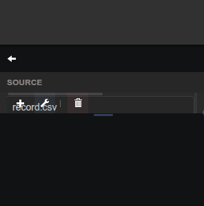

# Serial CSV Recorder

Start/stop recording of a serial datasource stream to a CSV file with configurable format options.

## Parameters

| Parameter   | Type    | Default    | Description                                   |
|-------------|---------|------------|-----------------------------------------------|
| File Path   | text    | record.csv | Output CSV file path.                         |
| Separator   | text    | :          | Field separator used in the incoming stream.  |
| End Of Line | text    | \n         | Line ending used in the incoming stream.      |
| Data Order  | option  | old        | Oldest-first or newest-first row ordering.    |
| Add Header  | boolean | true       | Write column names on the first line.         |
| Timestamp   | option  | none       | Off, relative elapsed time, or wall-clock.    |
