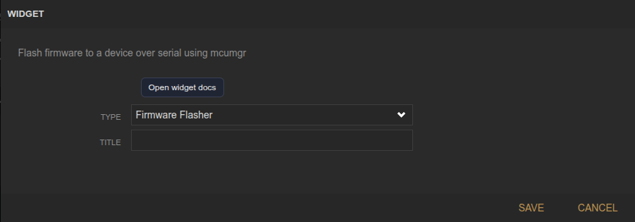
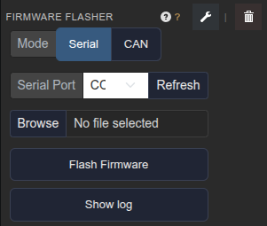

<!-- Widget documentation (auto-generated from widget definitions). -->
# Serial Flasher

## What it does
Flash firmware to a device over serial or CAN using mcumgr.

## Creation (settings)

- Title: Widget title.

## Usage (in dashboard)

- Mode: Choose Serial or CAN flashing.
- Serial Port: Select a serial port and refresh the list.
- CAN Interface: Select CAN interface and refresh.
- Target Node: Select CAN node and scan for devices.
- Flash all nodes: Toggle between single target and all nodes.
- Browse: Choose firmware file.
- Flash Firmware: Start flashing.
- Cancel: Stop an active flash.
- Show log: Toggle the log output area.

