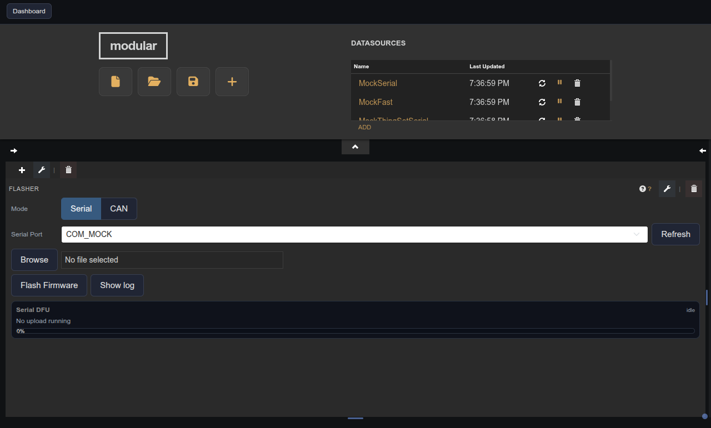
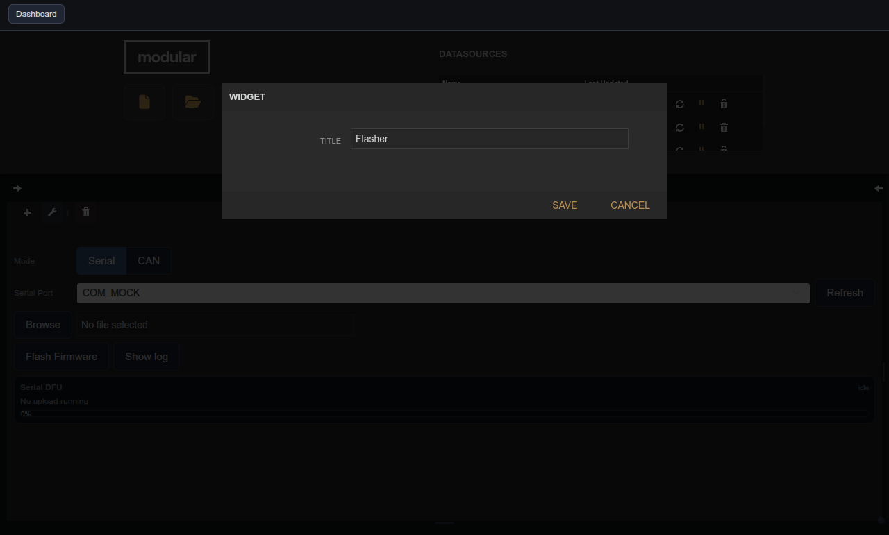

# Serial Flasher

| Widget View | Edit Widget Window View |
|---|---|
|  |  |

Flash firmware to a device over serial or CAN using mcumgr.

## Parameters

| Parameter | Type | Default | Description                     |
|-----------|------|---------|---------------------------------|
| Title     | text | —       | Label shown in the pane header. |
