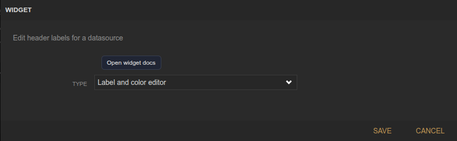
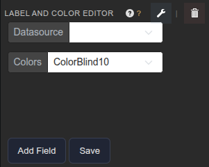

<!-- Widget documentation (auto-generated from widget definitions). -->
# Serial Header Editor

## What it does
Edit labels and colors for datasource channels.

## Creation (settings)

- No settings: Configuration is done in the widget UI.

## Usage (in dashboard)

- Datasource selector: Pick a datasource to edit.
- Colors palette: Apply a preset palette.
- Rows: Edit label + color per channel.
- Add Field: Append a new channel row.
- Save: Write labels/colors back to the datasource.

