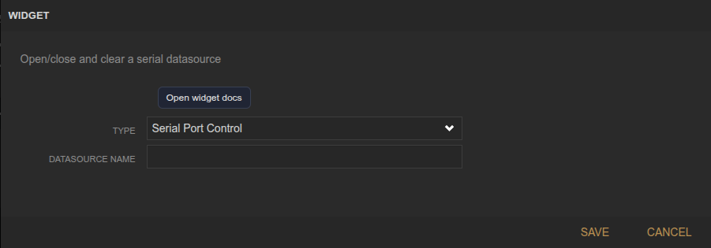
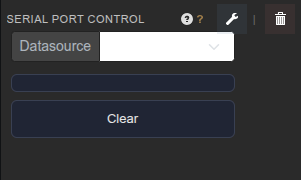

<!-- Widget documentation (auto-generated from widget definitions). -->
# Serial Port Control

## What it does
Open/close and clear a serial datasource.

## Creation (settings)

- Datasource Name: Serial datasource to control.

## Usage (in dashboard)

- Datasource selector: Choose the serial datasource.
- Open/Pause: Open or pause the serial port.
- Clear: Flush buffers for the datasource.

