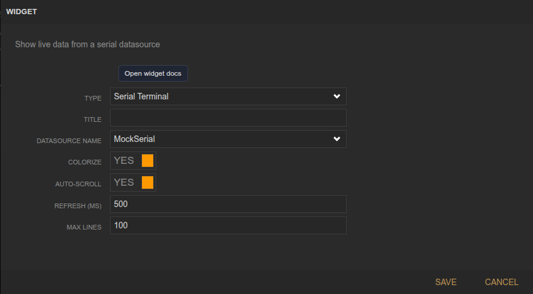
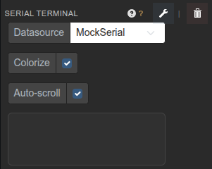

<!-- Widget documentation (auto-generated from widget definitions). -->
# Serial Terminal

## What it does
Terminal view for live serial data with optional colorization and auto-scroll.

## Creation (settings)

- Title: Widget title.
- Datasource Name: Serial datasource to read from.
- Colorize: Colorize fields using datasource header colors.
- Auto-scroll: Keep the view pinned to the latest data.
- Refresh (ms): Polling interval for updates.
- Max Lines: Maximum lines retained in the display.

## Usage (in dashboard)

- Datasource selector: Shows available serial datasources (e.g., MockSerial).
- Colorize toggle: Enable/disable colored fields.
- Auto-scroll toggle: Enable/disable auto-scroll.
- Output area: Live text/field stream from the serial port.

