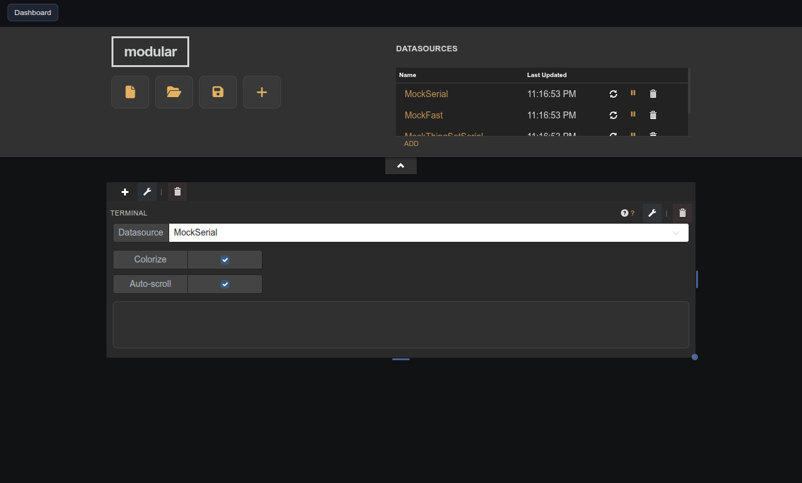
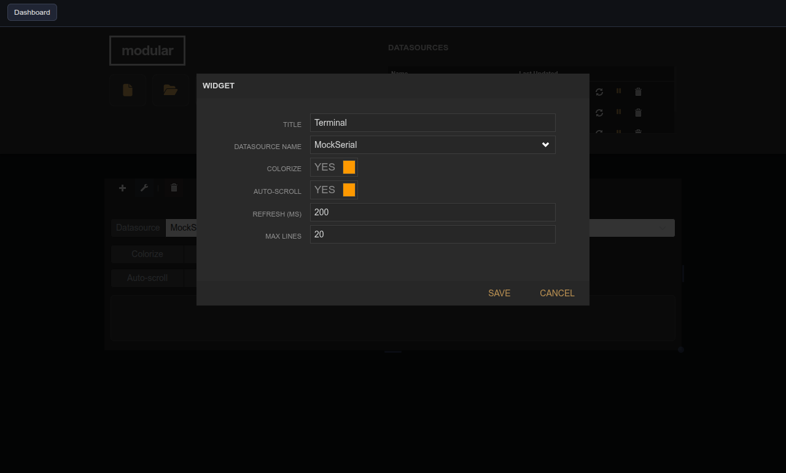

# Serial Terminal

| Widget View | Edit Widget Window View |
|---|---|
|  |  |

Live terminal view of a serial datasource with optional colorization and auto-scroll.

## Parameters

| Parameter    | Type    | Default | Description                                         |
|--------------|---------|---------|-----------------------------------------------------|
| Title        | text    | —       | Label shown in the pane header.                     |
| Datasource   | option  | —       | Serial datasource to read from.                     |
| Colorize     | boolean | true    | Colorize fields using the datasource header colors. |
| Auto-scroll  | boolean | true    | Keep the view pinned to the latest data.            |
| Refresh (ms) | number  | 500     | Polling interval for display updates.               |
| Max Lines    | number  | 100     | Maximum lines retained in the view.                 |
