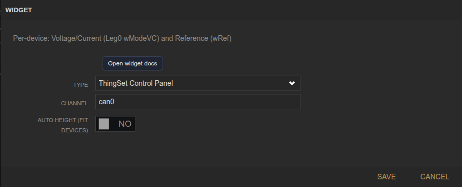
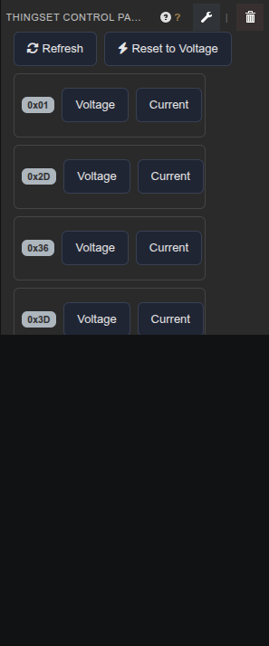

<!-- Widget documentation (auto-generated from widget definitions). -->
# ThingSet Control Panel

## What it does
Per-device control panel for voltage/current mode and reference.

## Creation (settings)

- Channel: CAN channel to target.
- Auto height (fit devices): Resize to match device count.

## Usage (in dashboard)

- Refresh: Reload device list and values.
- Reset to Voltage: Set all devices back to voltage mode.
- Voltage/Current: Select wModeVC per device.
- Reference input: Send wRef setpoints per device.

