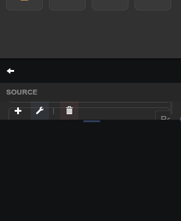
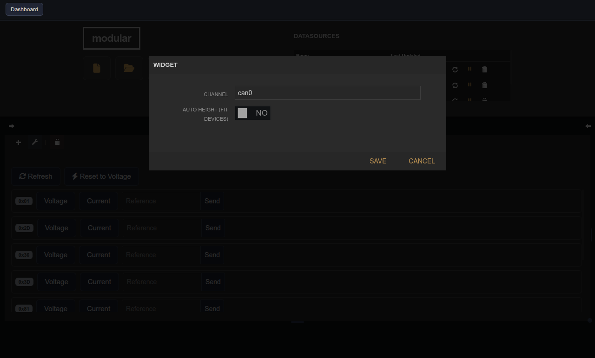

# ThingSet Control Panel

| Widget View | Edit Widget Window View |
|---|---|
|  |  |

Per-device voltage/current mode and reference control for ThingSet CAN devices.

## Parameters

| Parameter   | Type    | Default | Description                                              |
|-------------|---------|---------|----------------------------------------------------------|
| Channel     | text    | can0    | CAN channel to target.                                   |
| Auto Height | boolean | false   | Resize the panel to fit the number of connected devices. |
