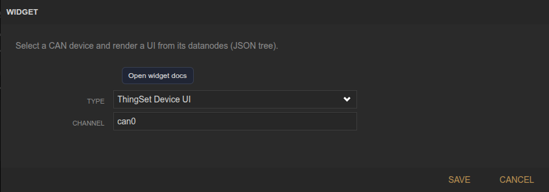
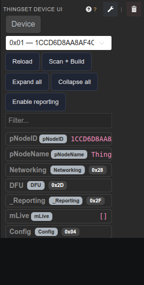

<!-- Widget documentation (auto-generated from widget definitions). -->
# ThingSet Device UI

## What it does
Render a ThingSet device UI by reading the CAN ThingSet tree.

## Creation (settings)

- Channel: CAN channel to scan (e.g., can0).

## Usage (in dashboard)

- Device selector: Choose a ThingSet device on the bus.
- Reload: Reload the UI for the selected device.
- Scan + Build: Scan CAN and rebuild the ThingSet tree.
- Expand/Collapse: Expand or collapse all tree nodes.
- Enable reporting: Toggle live reporting when supported.
- Filter: Filter nodes by name/path.

