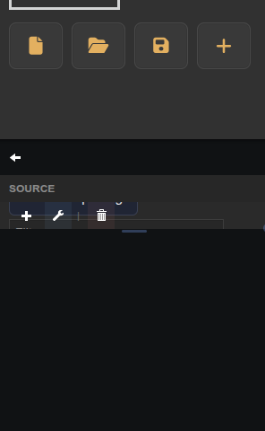

# ThingSet Device UI

Renders a full ThingSet device tree over CAN, with live value editing and reporting toggle.

## Parameters

| Parameter | Type | Default | Description                               |
|-----------|------|---------|-------------------------------------------|
| Channel   | text | can0    | CAN channel to scan for ThingSet devices. |
