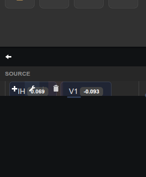
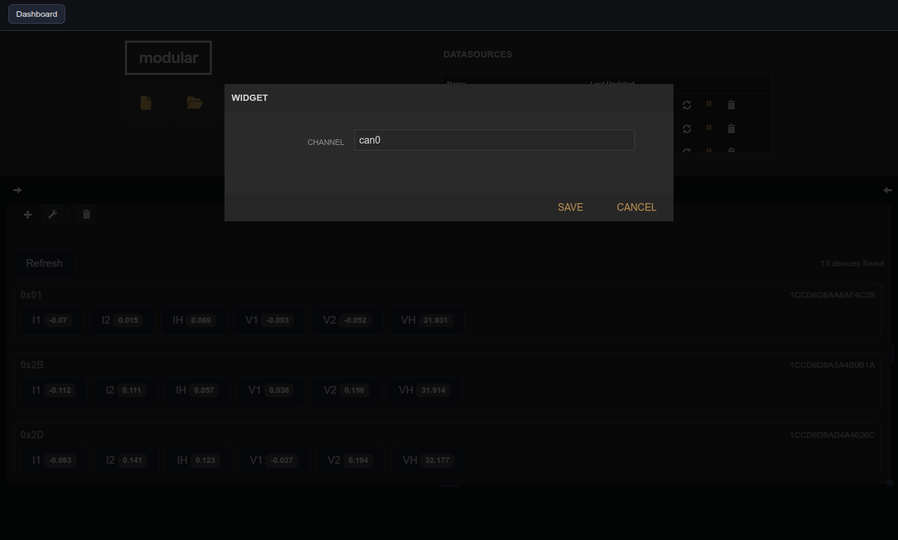

# ThingSet Measurements

| Widget View | Edit Widget Window View |
|---|---|
|  |  |

Toggle measurement subscriptions per ThingSet CAN device.

## Parameters

| Parameter | Type | Default | Description                               |
|-----------|------|---------|-------------------------------------------|
| Channel   | text | can0    | CAN channel to scan for ThingSet devices. |
