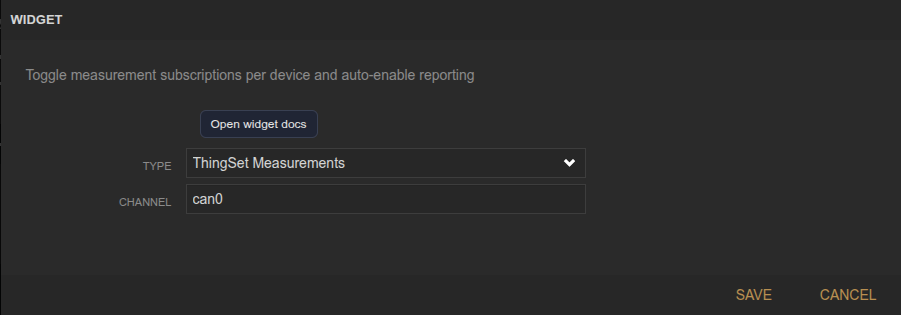
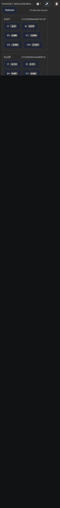

<!-- Widget documentation (auto-generated from widget definitions). -->
# ThingSet Measurements

## What it does
Toggle measurement subscriptions per ThingSet device.

## Creation (settings)

- Channel: CAN channel to scan.

## Usage (in dashboard)

- Refresh: Reload device list.
- Device cards: Show device IDs and measurement controls.
- Measurement toggles: Enable/disable per measurement.

