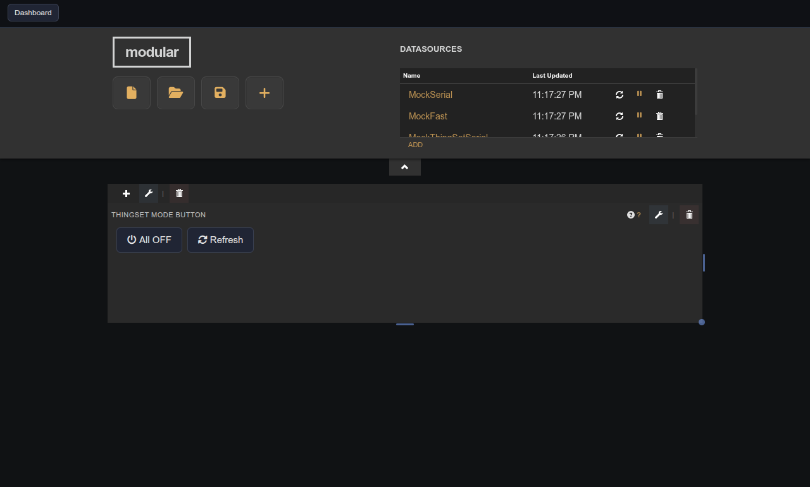
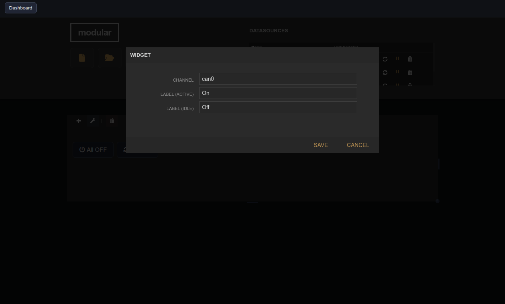

# ThingSet Mode Button

| Widget View | Edit Widget Window View |
|---|---|
|  |  |

Per-device power toggle for ThingSet CAN devices.

## Parameters

| Parameter   | Type | Default  | Description                             |
|-------------|------|----------|-----------------------------------------|
| Channel     | text | can0     | CAN channel to target.                  |
| Label (on)  | text | Power ON | Button label when the device is active. |
| Label (off) | text | Idle     | Button label when the device is idle.   |
