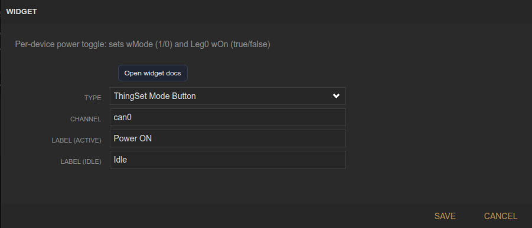
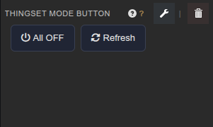

<!-- Widget documentation (auto-generated from widget definitions). -->
# ThingSet Mode Button

## What it does
Per-device power toggle for ThingSet devices.

## Creation (settings)

- Channel: CAN channel to target.
- Label (active): Text when device is ON.
- Label (idle): Text when device is OFF.

## Usage (in dashboard)

- All OFF: Disable all devices on the bus.
- Refresh: Reload device list and states.
- Per-device button: Toggle each device ON/OFF.

