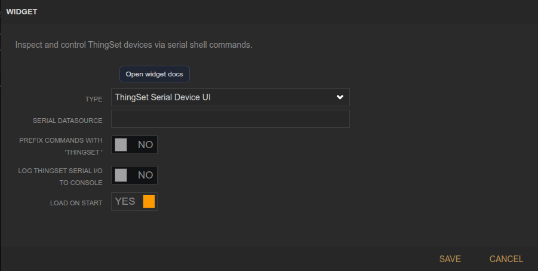
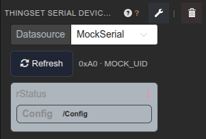

<!-- Widget documentation (auto-generated from widget definitions). -->
# ThingSet Serial Device UI

## What it does
Inspect and control ThingSet devices over the serial shell.

## Creation (settings)

- Serial datasource: Serial datasource used for ThingSet shell.
- Prefix commands with "thingset ": Send commands with an extra prefix.
- Log ThingSet serial I/O to console: Verbose logging for troubleshooting.
- Load on start: Auto-refresh the tree when the widget loads.

## Usage (in dashboard)

- Datasource selector: Choose the serial ThingSet datasource.
- Refresh: Reload tree and values.
- Tree view: Expand nodes and edit values.
- Status line: Shows loading state and errors.

