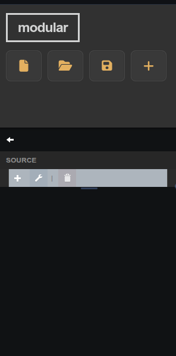
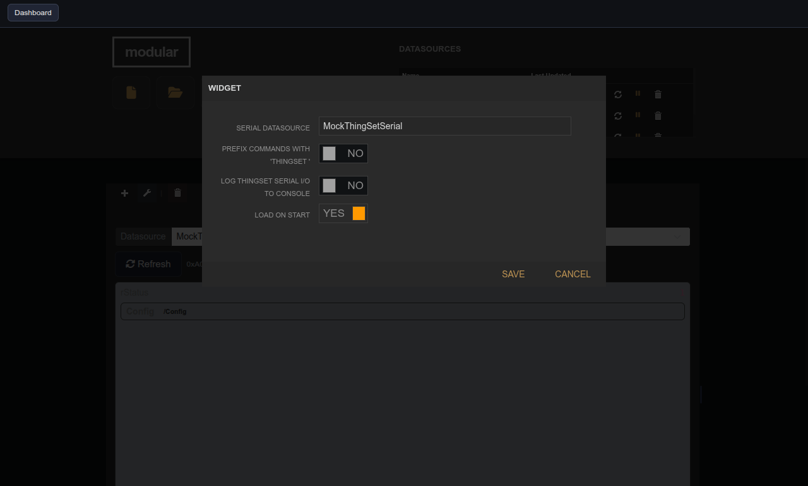

# ThingSet Serial Device UI

| Widget View | Edit Widget Window View |
|---|---|
|  |  |

Inspect and edit ThingSet device values over the serial shell.

## Parameters

| Parameter     | Type    | Default | Description                                         |
|---------------|---------|---------|-----------------------------------------------------|
| Datasource    | text    | —       | Serial datasource used for ThingSet shell commands. |
| Use Prefix    | boolean | false   | Prefix each command with 'thingset '.               |
| Debug Log     | boolean | false   | Log all ThingSet serial I/O to the console.         |
| Load on Start | boolean | true    | Auto-refresh the device tree when the widget loads. |
