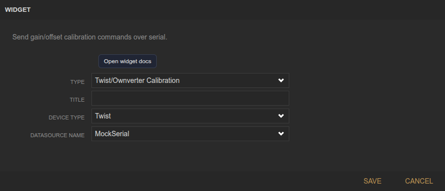
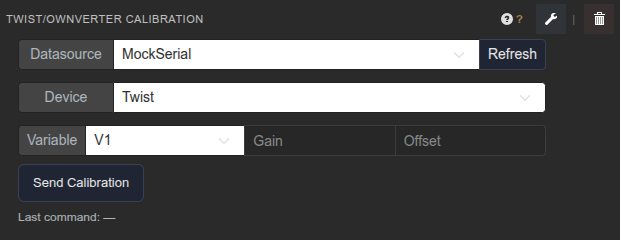

<!-- Widget documentation (auto-generated from widget definitions). -->
# Twist/Ownverter Calibration

## What it does
Send gain/offset calibration commands for Twist or Ownverter variables over serial.

## Creation (settings)

- Title: Widget title shown in the header.
- Device Type: Select Twist or Ownverter to match variable list.
- Datasource Name: Serial datasource used to send commands.

## Usage (in dashboard)

- Datasource: Choose the serial datasource.
- Device: Switch between Twist and Ownverter variable sets.
- Variable: Select the channel to calibrate (V/I variables).
- Gain / Offset: Calibration coefficients (8-decimal precision).
- Send Calibration: Sends the calibration command.
- Last command: Shows the most recent command sent.
