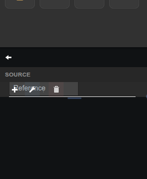

# Twist/Ownverter Setpoints

Send reference, duty, frequency, phase, and dead-time setpoints to a Twist or Ownverter board over serial.

## Parameters

| Parameter   | Type   | Default | Description                                   |
|-------------|--------|---------|-----------------------------------------------|
| Title       | text   | —       | Label shown in the pane header.               |
| Device Type | option | TWIST   | Board family: 2-leg Twist or 3-leg Ownverter. |
| Datasource  | option | —       | Serial datasource used to send commands.      |
