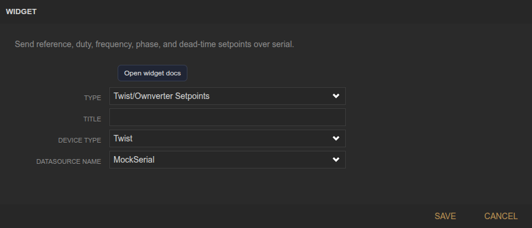
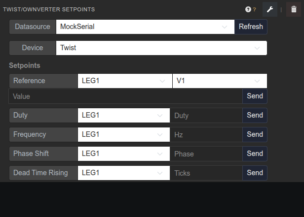

<!-- Widget documentation (auto-generated from widget definitions). -->
# Twist/Ownverter Setpoints

## What it does
Send reference, duty, frequency, phase, and dead-time setpoints for Twist or Ownverter boards.

## Creation (settings)

- Title: Widget title shown in the header.
- Device Type: Select Twist or Ownverter to match leg count and variables.
- Datasource Name: Serial datasource used to send commands.

## Usage (in dashboard)

- Datasource: Choose the serial datasource (e.g., MockSerial).
- Device: Switch between Twist (2 legs) and Ownverter (3 legs).
- Reference: Select leg/variable and send setpoints.
- Duty: Send duty cycle per leg.
- Frequency: Send switching frequency per leg.
- Phase Shift: Send phase shift per leg.
- Dead Time Rising/Falling: Send dead-time values per leg.
- Last command: Shows the most recent command sent.
