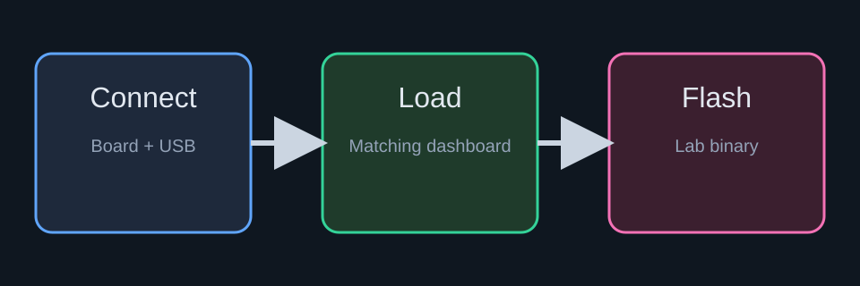

# Blinky Bring-Up

This courseware page packages a complete first lab in one folder:

- firmware binary for the target
- dashboard for live observation
- markdown instructions
- a local `figures/` directory for lab handouts

## Objective

Flash a known-good binary, load the matching dashboard, and verify the full
toolchain on a real target before moving to more advanced labs.

## Lab Flow

1. Connect the board over USB.
2. Use **Load blinky dashboard** to open the matching dashboard in Modular.
3. Select the correct serial port.
4. Use **Upload blinky to target** to flash the lab binary.
5. Confirm the board responds as expected.

## Figure

