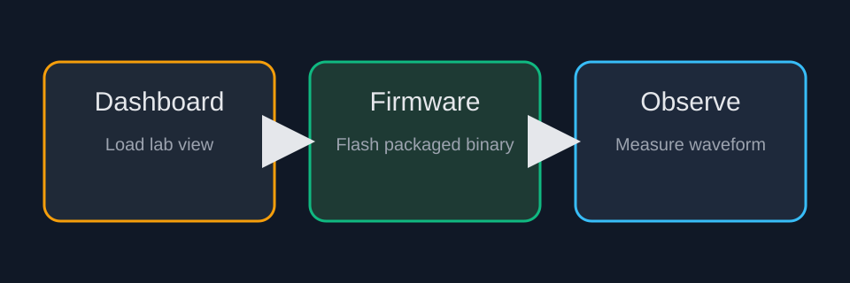

# Signal Generation Basics

This lab packages a ready-to-run practical session for signal-generation
bring-up. The page, dashboard, binary, and figures are all shipped together.

## Objective

Verify that the target firmware, dashboard bindings, and expected waveform
observation all line up before students modify parameters on their own.

## Lab Flow

1. Load the packaged dashboard.
2. Flash the packaged firmware.
3. Observe the generated signal in the dashboard widgets.
4. Record key measurements for the lab report.

## Figure

