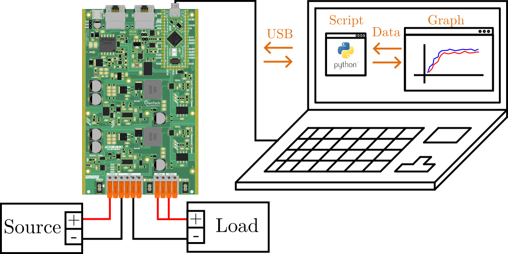
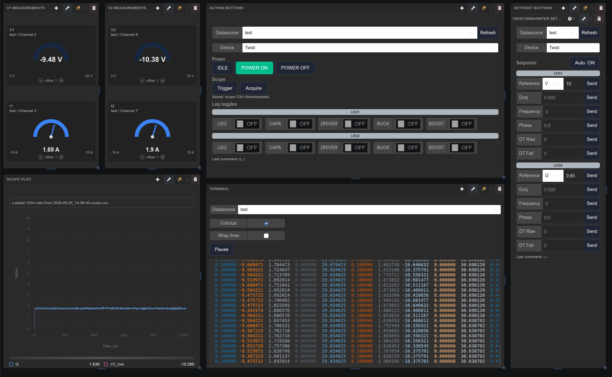
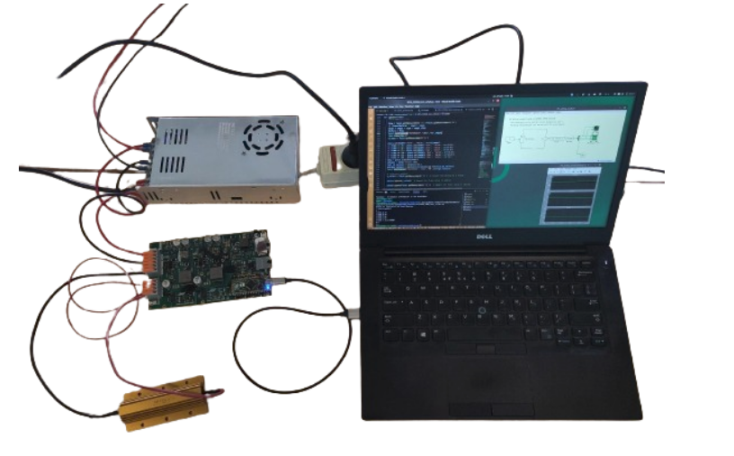

# DC-DC power converter dashboard control

This example is meant to be operated from the Modular dashboard in `../modular`, not from a standalone plotting script. Modular is a local desktop app for real-time instrumentation and device control: connect the hardware, stream data, visualize behavior, and interact with the firmware from the dashboard.

!!! danger Advanced example
    This is an advanced example. Make sure you are comfortable with using the [voltage mode](https://docs.owntech.org/examples/TWIST/DC_DC/buck_voltage_mode/) **before** using this test bench.

## Hardware wiring and requirements

The wiring of the system is given by the image below:
- The power converter is connected in `buck` mode with a source and a load.
- `LEG1` and `LEG2` are connected in parallel on the low side, as shown in the figure below.
- The converter is connected to the computer via its USB connector.



You will need:
- 1 TWIST (it works with the OWNVERTER too)
- 1 dc power supply (20-60V)
- 1 power load
- 1 PC

!!! warning Make sure you read this README all the way to the end.

## Embedded firmware setup

This project already includes the dependencies needed for dashboard control and scope capture. The dashboard communication layer is declared in `src/app.ini`:

```ini
lib_deps=
    comm_protocol = https://github.com/owntech-foundation/python_twist_comm_protocol.git#test_bench_protocol
```

The scope capture used by the dashboard is enabled by the `scope` dependency already listed in `platformio.ini`.

## Embedded firmware behavior

The firmware exposes three operating modes to the dashboard:

1. **IDLE**
   - Stops data broadcasting.
   - Stops the power flow.

2. **POWER_OFF**
   - Keeps the power stage off.
   - Broadcasts state and status variables so the user can monitor the system safely.

3. **POWER_ON**
   - Turns the power stage on.
   - Broadcasts physical measurements such as voltages, currents, and temperatures.
   - Runs the power-flow control loop with the embedded PID.

The dashboard sends structured serial commands to the board, and the communication task updates the relevant control and state variables on the firmware side.

## Dashboard workflow

Normal interaction happens through the dashboard below. `comm_script.py` remains in the repository as a low-level protocol example, but the intended user workflow is the dashboard.



From the dashboard, the user can:
- put the converter in `IDLE`;
- switch to `POWER OFF` to monitor state variables while the power stage remains off;
- switch to `POWER ON` to energize the converter and monitor physical variables in real time;
- adjust leg toggles and setpoints from the control panels.

## Scope capture

A scope is attached to the dashboard. `Trigger` arms the on-board `ScopeMimicry` acquisition, and `Acquire` retrieves the recorded data, saves a timestamped CSV, and displays it in the scope plot. This is the path used to capture data around a trigger event and during a `POWER ON` transient.

## Hardware setup

This code was tested using the following hardware setup:



On the photo:
- A computer running the dashboard.
- A Twist board connected in Buck mode.
- A voltage source.
- A LED light connected to `LEG1` 
- A motor connected to `LEG2`.

## How to use this example

Before running the code:

!!! warning Make sure you have:
    - followed the wiring shown above;
    - the appropriate libraries from `platformio.ini` and `src/app.ini`;
    - flashed `src/main.cpp` to the board;
    - launched the Modular dashboard from `../modular` and connected it to the USB device.

If you are running Modular from source, use the quick start instructions in `../modular/README.md`.

Once everything is connected, use the dashboard `Action Buttons` to move between `IDLE`, `POWER OFF`, and `POWER ON`, the `Setpoint Buttons` to send references, and the scope panel to trigger and retrieve acquisitions.
