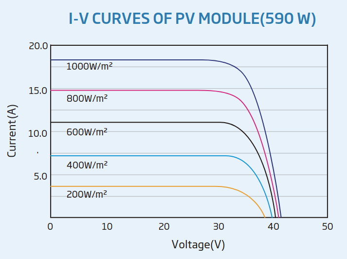
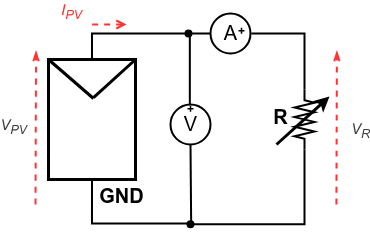
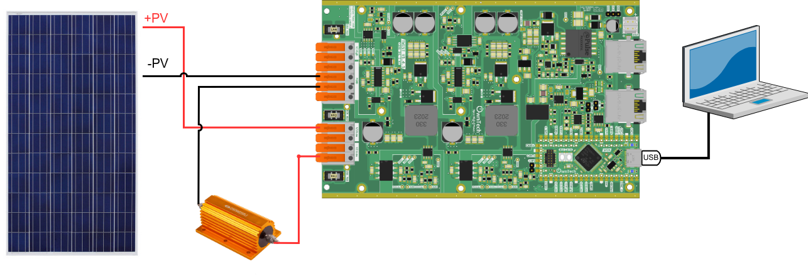
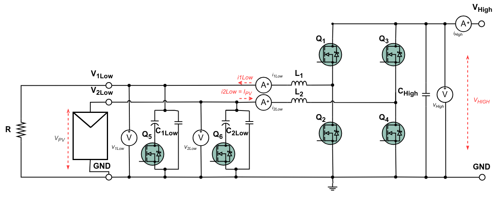
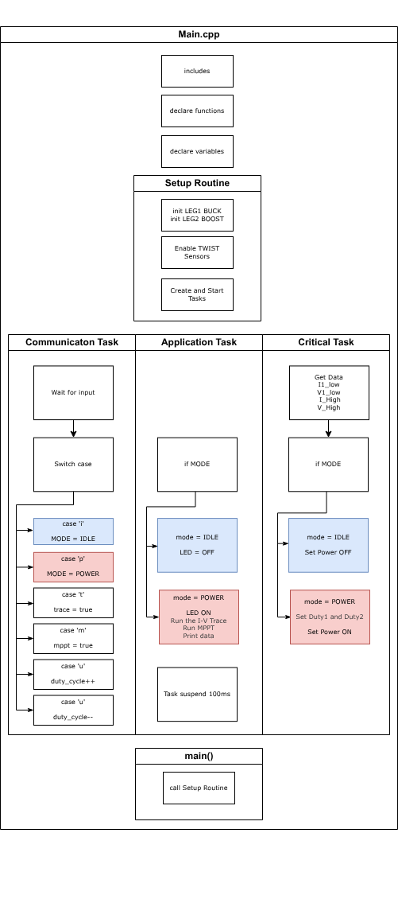

# I-V Tracer and MPPT tracker

In photovoltaics, it is often useful to have a clear view of the I-V curve of a given panel. These curves are usually given by the manufacturer and look something like the one below given for a [Trina Vertex Solar module](https://www.trinasolar.com/sites/default/files/600WVertex.pdf). 



_Figure 1 - Vertex solar module I-V curve_


In this example, we will use a Twist board to trace the I-V curve for a given PV module and then track its maximum power point (MPPT). 

We will build from the Basic example, expanding on its core ideas and providing the foundations for a later MPPT example. 

!!! warning "Are you ready to start ?"
    Before you can run this example, you must have successfully gone through our [getting started](https://docs.owntech.org/latest/core/docs/environment_setup/).  

---
## Working Principle

A photovoltaic module is a voltage controlled current source. The maximum current a PV module can produce depends on the intensity on the light shinning upon it (or the irradiance). 

Thus, if you vary the voltage in its terminals, you can control its current and vice-versa. The typical way of representing this is by connecting a resistor to the output as shown in _Figure 2_.


_The equivalent circuit of an I-V tracer_


In this example we will explore a simple way to make current flow out of the PV module automatically, providing us with the data necessary to create an I-V curve.


---
## Hardware setup and requirement

!!! note Bill of materials
    To run this example you will need: 
    - 1 Twist board
    - 1 PV module
    - 1 Power resistor (capable of widthstanding the current of your module)
    - Cables to connect the Twist module to your PV module and your resistor  

The PV module will be connected to `VLow2` and a resistor to  `VLow1`. `VHigh` will be left floating. The wiring diagram is shown in the figure below.





The circuit diagram of the board is shown in the image below.



This setup mixes a step-up and step-down implementation as seen in the image below.


--- 

#### Main code structure

The `main.cpp` structure is shown in the image below.



The code structure is as follows:
- On the top of the code some initialization functions take place.
- **Setup Routine** - calls functions that set the hardware and software
- **Communication Task** - Handles the keyboard communication and decides which `MODE` is activated. It also triggers the I-V trace. 
- **Application Task** - Handles the `MODE`, activates the LED and prints data on the serial port 
- **Critical Task** - Handles the `MODE`, sets power ON/OFF and sets the `duty_cycle` of both legs

The tasks are executed following the diagram below. 


- **Communication Task** - Is awaken regularly to verify any keyboard activity
- **Application Task** - This task is woken once its suspend is finished 
- **Critical Task** - This task is driven by the HRTIM count interrupt, where it counts a number of HRTIM switching frequency periods. In this case 100us, or 20 periods of the TWIST board 200kHz switching frequency set by default.


---

### Control scheme

Since the objective of this exmaple is to trace the I-V curve, no control will be implemented. However, a safeguard is put in place to avoid having over voltages. 

---

## Expected result

This code will impose the same duty cycle ramp to both `LEG1` and `LEG2`. 

This will make two things happen simultaneously: 
- Voltage on the `VHigh` bus will go up, as `duty_cycle2` raises. 
- The current on the resistor will go up, as `duty_cycle` raises.
- Since their values are the same, this is the equivalent of connecting the PV module to a variable resistor. 

To vizualize the I-V trace, download and open [modular](https://github.com/owntech-foundation/modular/releases).

<!-- Add more text here with the right screenshots -->


When opening it for the first time, the serial monitor will give you an initialization message regarding the parameters of the ADCs as shown below.  


!!! tip Commands keys
    - press `i` to enter idle mode
    - press `t` to trace the I-V curve


!!! note The data that you see
    When you send `p` the Twist board will send you back a stream of data on the following format: 
    
    ```c 
    I2:V2:duty1:duty2:
    ```
    Where: 
    - `I2` is the current in `LEG2` of the `LOW` side, corresponding to `IPV`
    - `V2` is the voltage in `LEG2` of the `LOW` side, corresponding to `VPV`
    - `duty1` is the duty cycle of `LEG1`
    - `duty2` is the duty cycle of `LEG2` 

