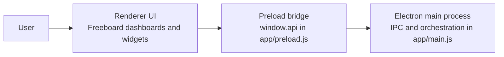
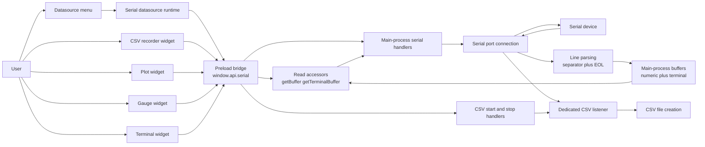
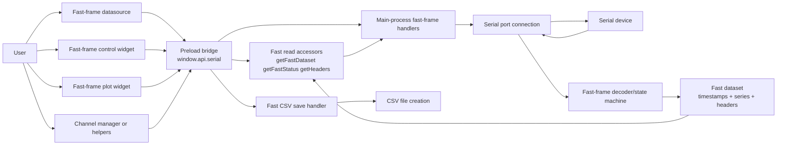
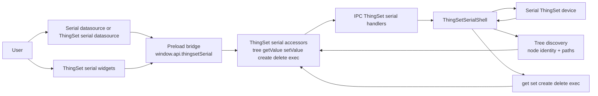
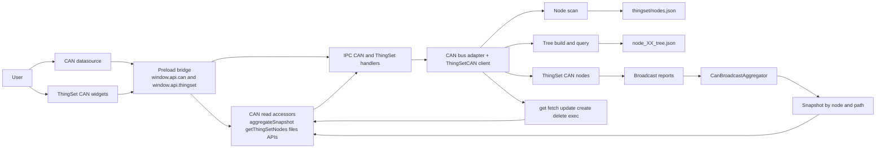
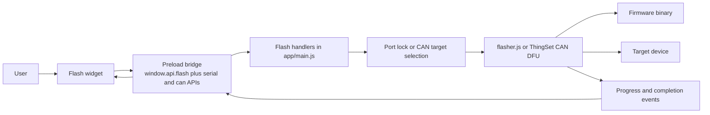

# App Functional Diagram

This document describes the app in terms of workflows rather than modules.

## Workflow Split

The top-level workflow split is:

- `Serial`: standard line-based serial streaming, terminal logging, plotting, gauges, and CSV recording.
- `Fast Serial`: structured fast-frame acquisition over serial, stored separately from normal line streaming.
- `ThingSet`: structured device access, but it exists in two transport variants:
  - ThingSet over serial shell
  - ThingSet over CAN
- `Firmware flashing`: operational workflow that temporarily takes control of a device port or CAN target.

## Shared Runtime Structure

All workflows pass through the same top-level application layers:

- The renderer collects user actions and renders dashboards, docs, and widgets.
- The preload layer exposes a safe API and forwards IPC calls.
- The main process owns hardware access, file access, shared buffers, and long-running operations.

## Workflow 1: Serial

This is the standard serial telemetry path.
It is used when a device emits text or delimited numeric data continuously and the dashboard consumes it as a stream.

### How this workflow works

- The user configures a serial datasource in the datasource menu.
- The serial datasource plugin opens the port through `window.api.serial.openPort(...)` or the matching IPC call.
- The main process opens the port, stores parser settings, and starts reading bytes.
- Incoming data is split into lines using the configured end-of-line token.
- Each line is parsed into values for plots and gauges, and also copied into a terminal buffer.
- The datasource runtime polls the latest parsed values and publishes them into Freeboard datasource state.
- Widgets depend on that datasource state for normal dashboard behavior.
- Some widgets also read main-process buffers through explicit accessors such as `getBuffer` and `getTerminalBuffer`.
- Those accessor calls go through the preload bridge first, using `window.api.serial`, which then invokes the corresponding IPC handlers in `main.js`.
- CSV recording is separate: the recorder widget calls `startCsvRecord` or `stopCsvRecord`, and the main process attaches a dedicated `data` listener to the serial port to write rows to disk.

### Main functions in this workflow

- `get-serial-ports`: lists available ports for the UI.
- `open-serial-port`: opens and configures a serial connection.
- `write-serial-port`: sends manual commands or control values.
- `get-serial-buffer`: exposes parsed numeric samples.
- `get-terminal-buffer`: exposes the raw line history for terminal widgets.
- `start-csv-record` and `stop-csv-record`: attach and remove a dedicated recording listener on the port and persist streamed data to CSV.
- `flush-serial-buffers`: resets state for a port.

### Implementation Notes

- Serial port opening is driven by the datasource, not by the widgets.
- In the code, `serialport_datasource` calls `openPort()` during datasource initialization and on settings changes.
- Serial widgets do not have direct access to the main-process buffers.
- In the intended architecture they fetch buffer contents through the preload bridge, for example `window.api.serial.getBuffer(...)` and `window.api.serial.getTerminalBuffer(...)`.
- The preload bridge then calls `ipcRenderer.invoke(...)`, which reaches the IPC handlers in `main.js`.
- Many widgets also rely on Freeboard datasource values produced by the datasource runtime, which is another reason they should not be shown as owning the port connection.
- The CSV recorder also does not read from those buffers.
- Instead, `start-csv-record` installs its own serial-port `data` listener in the main process and writes directly to the target CSV file.

### What this workflow is for

- Generic text-based telemetry.
- Dashboard plots and gauges from line-oriented data.
- Serial terminal interaction.
- Simple recording of streamed values.

## Workflow 2: Fast Serial

This is a separate acquisition mode with its own state, buffers, headers, and export path.

### How this workflow works

- The user opens a datasource or widget configured for `fast_frame_datasource`.
- The datasource owns the serial port connection, just like in the normal serial workflow.
- The main process opens the same physical kind of serial port, but tracks it with fast-frame-specific state.
- Incoming lines are interpreted by the fast-frame parser instead of being treated only as ordinary streaming values.
- Captured acquisitions are stored as structured datasets with timestamps and multiple series.
- Widgets and helper controls read the dataset and acquisition status through the preload bridge, using accessors such as `getFastDataset`, `getFastStatus`, `getHeaders`, and `getColors`.

### Main functions in this workflow

- `open-serial-port` with `type = fast_frame_datasource`: prepares the port for fast-frame use.
- `get-fast-dataset`: returns the captured dataset.
- `get-fast-frame-status`: returns acquisition state and progress.
- `save-fast-csv`: exports the dataset after capture.
- `get-serial-headers` and `set-serial-headers`: manage channel labels used by fast-frame views.
- `get-serial-colors` and `set-serial-colors`: manage display color metadata.

### What this workflow is for

- Burst capture rather than only continuous text streaming.
- Multi-channel measurement datasets.
- Plot widgets that expect structured sampled data instead of ad hoc parsed rows.

## Workflow 3: ThingSet

This workflow has two concrete implementations:

- ThingSet over serial shell.
- ThingSet over CAN.

In both cases the interaction model is structured: paths, IDs, values, trees, commands, and reports.

### 3A. ThingSet Over Serial

#### How this workflow works

- The app probes serial ports for a ThingSet-capable shell.
- Once detected, it enters the ThingSet shell mode.
- The app can read node identity, build a tree, and run structured commands against device paths.
- Widgets call into `window.api.thingsetSerial`, and the preload bridge forwards those requests to `main.js`.
- Tree data and read or write results come back through the same path.

#### Main functions in this workflow

- `ts-serial-detect`: probes ports for a ThingSet shell.
- `ts-serial-tree`: reads the available object tree.
- `ts-serial-get-value`: reads a structured value.
- `ts-serial-set-value`: updates a value.
- `ts-serial-create`, `ts-serial-delete`, `ts-serial-exec`: perform object operations.

### 3B. ThingSet Over CAN

#### How this workflow works

- The app opens a CAN bus and constructs a `ThingSetCAN` client.
- It scans the bus for nodes and saves discovery results in `thingset/nodes.json`.
- It can build per-node tree files used later for path lookup and decoding.
- It sends structured ThingSet requests such as `get`, `fetch`, or `update`.
- Separately, the broadcast aggregator listens for report frames and keeps a live node snapshot.
- Widgets and CAN datasources call into the preload bridge first. In normal operation they use `window.api.can`, `window.api.thingset`, `window.api.files`, and `window.api.paths`.

#### Main functions in this workflow

- `can-open` and `can-close`: manage the CAN transport.
- `can-scan-nodes`: discovers available ThingSet nodes.
- `can-build-trees`: builds cached JSON trees for nodes.
- `ts-get`, `ts-fetch`, `ts-update`, `ts-create`, `ts-delete`, `ts-exec`: structured ThingSet operations over CAN.
- `ts-paths-for-ids` and `ts-ids-for-paths`: map between numeric IDs and logical paths.
- `can-aggregate-start`, `can-aggregate-stop`, `can-aggregate-snapshot`: manage live broadcast decoding.

### What the ThingSet workflow is for

- Structured device control.
- Tree-based inspection instead of free-form serial parsing.
- Multi-node networks over CAN.
- Persistent mapping between node IDs, paths, and live values.

## Firmware Flashing

It is a maintenance operation that temporarily interrupts or bypasses normal telemetry.

### How this workflow works

- The user selects a firmware image and a target.
- The main process prevents conflicting access to the same device.
- For serial flashing, the app uses `mcumgr` through [`flasher.js`](/home/luiz-villa/code/modular/app/flasher.js).
- For CAN flashing, the app uses the ThingSet DFU path.
- The flash widget uses the preload bridge for command and event flow, then progress returns to the widget through preload callbacks.

## Preload Usage Across Workflows

All workflows use the preload bridge in the primary architecture.

- Serial widgets use `window.api.serial`.
- Fast-frame widgets use `window.api.serial`.
- ThingSet serial widgets use `window.api.thingsetSerial`.
- CAN datasources and ThingSet CAN widgets use `window.api.can`, `window.api.thingset`, `window.api.files`, and `window.api.paths`.
- Firmware flashing uses `window.api.flash`, plus serial and CAN APIs for selection helpers.

Compatibility note:

- Several plugins still keep a fallback to raw `window.require('electron').ipcRenderer` when `window.api` is unavailable.
- That is a compatibility path, not the intended primary structure.
- For documentation purposes, the diagrams should continue to show `renderer -> preload -> main process`.

## Recommended Mental Model

The app can be summarized as:

- `Serial`: passive or lightly interactive stream processing.
- `Fast Serial`: structured high-rate serial acquisition.
- `ThingSet`: structured object-oriented device access over serial shell or CAN.
- `Flashing`: device update workflow with exclusive access requirements.
