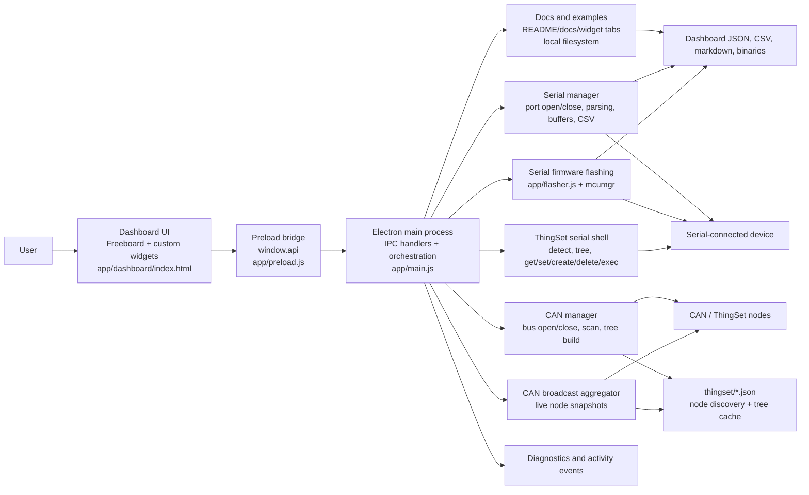

# App Functional Diagram

This document is a first-pass map of how the app works.
It is meant to make the runtime structure visible so the system can be refined and documented in more detail later.

## Functional Diagram

## Main Parts

### 1. Dashboard UI

The renderer is the operator-facing layer loaded from `app/dashboard/index.html`.
It provides the visible dashboard, widgets, documentation tabs, example views, and actions such as opening dashboards, recording CSV files, or starting firmware flashing.

Broadly, this layer is responsible for:

- Rendering dashboards and widgets.
- Collecting user actions and settings.
- Displaying streamed values, terminal logs, plots, gauges, and status messages.
- Calling the preload API instead of touching Node or Electron directly.

### 2. Preload Bridge

`app/preload.js` exposes a controlled `window.api` object to the renderer.
This is the boundary between the browser-like UI and the privileged Electron main process.

Broadly, it works by:

- Defining grouped APIs such as `dashboard`, `serial`, `flash`, `can`, `thingset`, and `docs`.
- Translating renderer requests into `ipcRenderer.invoke(...)` or `ipcRenderer.send(...)` calls.
- Forwarding main-process events like flash progress and activity updates back into the UI.

This keeps the renderer isolated while still allowing the app to access serial ports, files, and native tools.

### 3. Electron Main Process

`app/main.js` is the runtime coordinator.
It creates the application window, builds menus, owns most IPC handlers, and decides which backend service should handle each request.

Broadly, it works by:

- Creating the main Electron window and loading the dashboard UI.
- Registering IPC handlers for files, serial, flashing, docs, examples, CAN, ThingSet, and diagnostics.
- Holding shared runtime state such as open serial ports, fast-frame buffers, CAN buses, and aggregators.
- Emitting activity/progress events so the renderer can show status to the user.

This file is effectively the control plane of the desktop app.

### 4. Serial Data Path

The serial subsystem lets dashboards talk to boards over COM/TTY ports.
It is used for normal streaming, terminal-style logs, fast-frame capture, and CSV recording.

Broadly, it works by:

- Listing available serial ports with `serialport`.
- Opening a port and storing parser settings such as separator and end-of-line.
- Reading incoming bytes, splitting them into lines, parsing values, and updating in-memory buffers.
- Exposing those buffers back to widgets through IPC for plots, terminals, gauges, and recorders.
- Saving captured datasets to CSV when requested.

This is the main live telemetry path for serial-connected hardware.

### 5. Serial Firmware Flashing

Serial firmware flashing is handled by [`app/flasher.js`](/home/luiz-villa/code/modular/app/flasher.js) and coordinated from [`app/main.js`](/home/luiz-villa/code/modular/app/main.js).
It uses `mcumgr` and temporarily takes ownership of the serial port.

Broadly, it works by:

- Asking the user for a firmware `.bin` file.
- Locking the target serial port so dashboard datasources do not interfere.
- Touching the port at 1200 baud when needed to trigger bootloader entry.
- Running `mcumgr` commands to add the connection, upload the image, and reset the board.
- Streaming progress and error text back to the UI.

This path is separate from normal telemetry because flashing needs exclusive access and a stricter sequence.

### 6. ThingSet Over Serial

The app also supports a command-oriented ThingSet serial shell.
This is different from passive serial streaming because it actively queries and modifies device state.

Broadly, it works by:

- Probing candidate serial ports to detect a ThingSet-capable shell.
- Entering the shell and reading device identity fields such as node UID, name, and address.
- Performing operations like tree discovery, get, set, create, delete, and exec through IPC helpers.

This path is useful when the UI needs structured device interaction instead of raw line parsing.

### 7. CAN and ThingSet Over CAN

CAN support is built around a shared bus abstraction in [`app/js/can_adapter.js`](/home/luiz-villa/code/modular/app/js/can_adapter.js) and ThingSet client helpers in `app/js/`.
On Linux, the app uses SocketCAN; Windows support is planned via vendor bindings.

Broadly, it works by:

- Opening a CAN channel such as `can0`.
- Creating a reusable ThingSet client for request/response operations.
- Scanning the bus for nodes and writing discovery results to `thingset/nodes.json`.
- Building node trees and caching them as JSON for later lookup and path resolution.
- Executing ThingSet operations like get, fetch, update, create, delete, and exec over CAN.

This subsystem gives the app a structured network view of multiple embedded nodes instead of a single serial endpoint.

### 8. CAN Broadcast Aggregator

The CAN broadcast aggregator listens for asynchronous ThingSet report traffic and turns raw frames into a usable node snapshot.

Broadly, it works by:

- Subscribing to incoming CAN frames on an open bus.
- Reassembling multi-frame reports and decoding single-frame reports.
- Resolving numeric item IDs into readable paths using cached ThingSet tree files.
- Maintaining a per-node snapshot that the renderer can request through IPC.

This lets the UI consume live network state without polling every value individually.

### 9. Documentation and Examples

The app includes built-in docs and examples rather than treating them as separate website content.
Menus and tabs are populated from markdown files and widget metadata inside the repository.

Broadly, it works by:

- Discovering markdown files under `app/docs/` and `app/dashboard/docs/`.
- Building menu entries for examples and widget documentation.
- Opening those docs in tabs or a dedicated example window.
- Reading and writing supporting files through IPC when needed.

This makes the app partly self-documenting, which is useful for onboarding and repeatable lab workflows.

## Core Workflows

### Live monitoring

1. The user configures a dashboard widget in the renderer.
2. The widget calls the preload API.
3. The main process opens a serial port or CAN channel.
4. Data is buffered, parsed, and exposed back to the renderer.
5. Widgets render plots, gauges, logs, or controls from that live state.

### Firmware update

1. The user selects a board and firmware file.
2. The renderer requests a flash through IPC.
3. The main process locks the serial port and starts the flasher.
4. `mcumgr` uploads and resets the target.
5. Progress events flow back to the UI until completion.

### ThingSet network exploration

1. The user opens CAN support or a ThingSet workflow.
2. The app scans nodes and writes `thingset/nodes.json`.
3. The app builds node tree JSON files for discovered devices.
4. Future reads, updates, and broadcast decoding use those cached trees.

## Working Assumption For Later Iterations

For now, the app can be understood as:

- A Freeboard-based renderer for dashboards and docs.
- A preload bridge that exposes safe app capabilities.
- A main-process orchestration layer that owns hardware access.
- A set of transport backends for serial, firmware flashing, ThingSet serial, and ThingSet CAN.

Future iterations can refine this into sequence diagrams, per-widget responsibilities, and a clearer separation between generic dashboard behavior and OwnTech-specific protocols.
